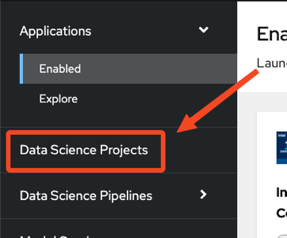

+++
title = "Environment Setup"
draft= false
weight= 2
[[resources]]
  src = '**.png'
+++

## Introduction

It is important to understand the key concepts we will be using in this AI workshop.

* **OpenShift AI** is an integrated platform that simplifies the management of AI projects in a cloud-native environment based on OpenShift.
* Each participant will work within a **Data Science Project**, which serves as an isolated space to organize resources such as data, notebooks, models, and pipelines.  
* The **Workbench** provides an interactive development environment based on Jupyter, where data scientists can write, run, and test their code.  
* The **Pipeline Server** is the engine that orchestrates, automates, and tracks the execution of the various steps in data processing and model training workflows.  
* A **Data Connection** allows the platform to connect to a storage source (e.g., S3 or Ceph) to save and share artifacts produced in a Workbench or a Pipeline.  
* Finally, the **Git repository** contains the project's source code, ensuring reproducibility and fostering collaboration around the same set of scripts and notebooks.

These components work together to provide a complete end-to-end process, from experimental development to model deployment.

## Connecting to a Project

1. In the OpenShift AI dashboard, open the *Data Science Projects* menu on the left:  


2. Each participant has been assigned a unique identifier at the start of the workshop. A project with the **same name** has been created for you. Click on it to open it. You should arrive at a page similar to this:  


## Creating a Data Connection

We have deployed a MinIO instance to handle object storage in the cluster. You will need to add a Data Connection pointing to this storage.

1. Scroll to the bottom of the project page and click on *Data connections*:  
  
The page will be empty for now.

2. Click on *Add data connection* and enter the following information:
- **Name**:  
```pipelines```
- **Access key**:  
```userX```  **⏪ REPLACE WITH YOUR ASSIGNED USERNAME**
- **Secret key**:  
``````
- **Endpoint**:  
``````
- **Region**:  
```none```
- **Bucket**:  
```userX```  **⏪ REPLACE WITH YOUR ASSIGNED USERNAME**

The result should look like this:  


3. Once the form is filled, click *Add data connection* to save it.

## Creating a Pipeline Server

It is recommended to create the Pipeline Server now, which will host your AI pipelines later. That's what we will do now:  

1. In the top menu, open the *Pipelines* tab and then click on *Configure pipeline server*.  


2. In the dropdown menu with the key icon, select the Data Connection you created earlier (named *pipelines*) to automatically fill the form with the saved information, and click the *Configure pipeline server* button.  


3. Wait for the Pipeline Server to finish creating. When it is ready, your screen should look like this:  

⚠️ It is essential to wait until the Pipeline Server creation is complete.

At this stage, you are connected to your Data Science Project, the Data Connection has been configured for storage, and your Pipeline Server is now ready and deployed for pipelines.
