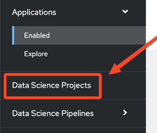
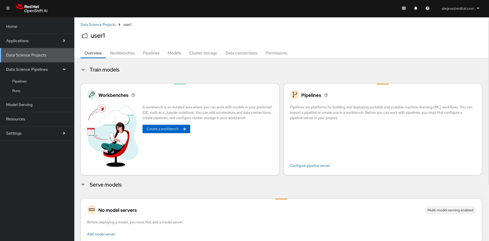
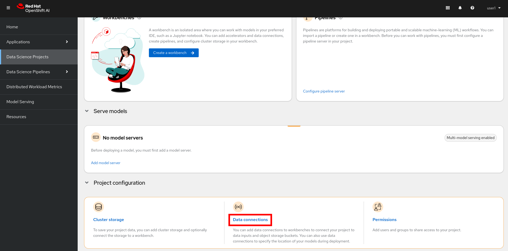
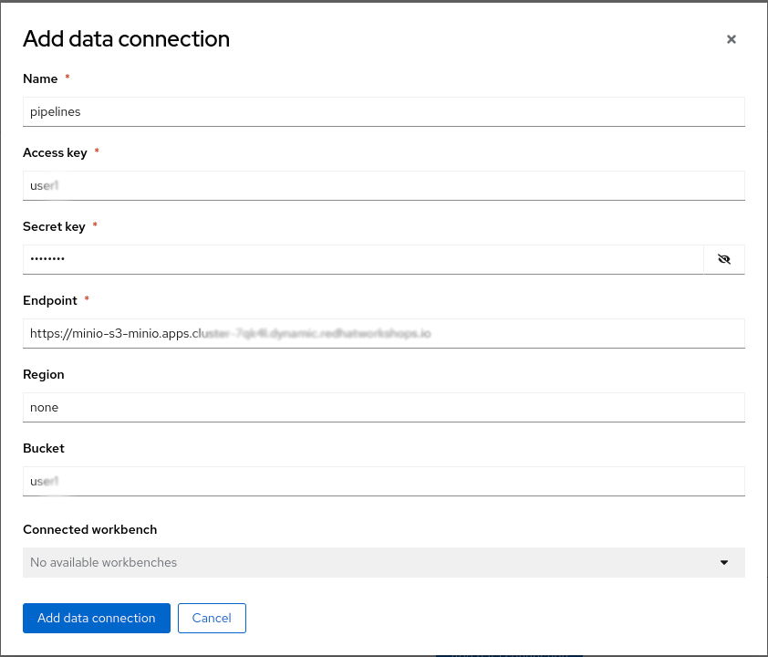
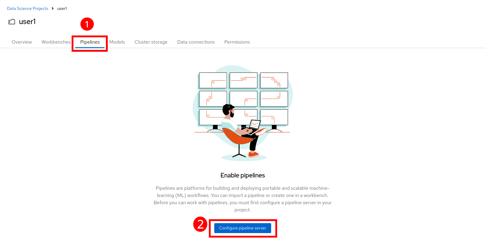
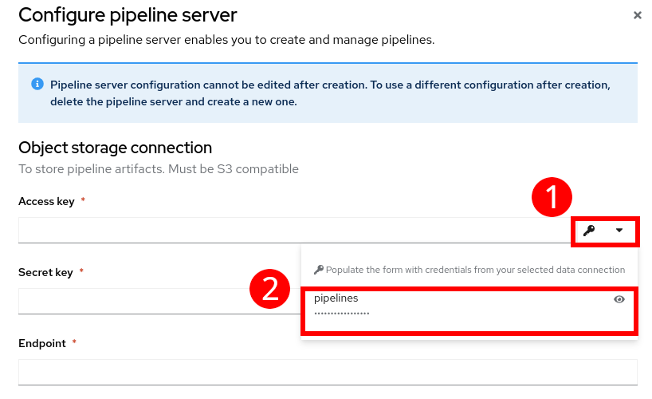
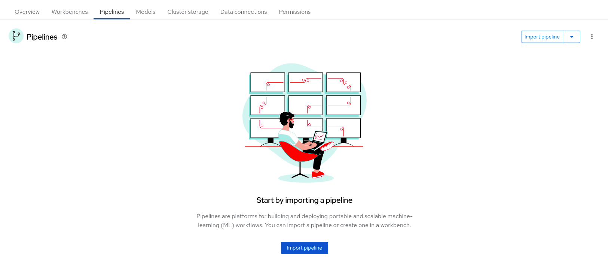

+++
title = "Préparation de l'environnement"
draft= false
weight= 2
[[ressources]]
  src = '**.png'
+++

## Introduction

Il est important de comprendre les principaux concepts que nous allons manipuler dans cet atelier autour d’OpenShift AI.

**OpenShift AI** est une plateforme intégrée qui facilite la gestion de projets d’IA dans un environnement cloud-natif basé sur OpenShift.

Chaque participant travaillera dans un **Projet Data Science**, qui sert d’espace isolé pour organiser ses ressources (données, notebooks, modèles, pipelines…).  
Une **Data Connection** permet de relier la plateforme à une source de stockage (par exemple S3 ou Ceph) afin de sauvegarder et partager les artefacts produits par les pipelines.  
Le **Pipeline Server** est le moteur d’orchestration qui exécute et trace les différentes étapes du traitement des données et de l’entraînement des modèles.  
Le **Workbench** fournit un environnement de développement interactif basé sur Jupyter, dans lequel les data scientists peuvent écrire, exécuter et tester leur code.  
Enfin, le **repo Git** contient le code source du projet, garantissant la reproductibilité et la collaboration autour du même ensemble de scripts et de notebooks.

Ces composants interagissent pour offrir une chaîne complète, du développement expérimental jusqu’à la mise en production des modèles.

Les instructions ci-dessous vous guideront tout au long de ces étapes. Suivez-les attentivement.

## Connexion à un projet

* Tout d'abord, dans le tableau de bord OpenShift AI, naviguez vers le menu `Data Science Projects` sur la gauche :


* Un identifiant unique vous a été attribué au début de l'atelier. Un projet portant le **même nom** que votre identifiant a été créé pour vous. Cliquez sur ce projet. Vous devriez arriver sur une page similaire :


## Créer une Data Connection pour le Pipeline Server

* Nous avons déployé une instance Minio pour gérer le stockage objet dans le cluster.
* Vous devrez **ajouter une Data Connection** qui pointe vers ce stockage. Faites défiler jusqu'au bas de la page du project et cliquez sur `Data Connections` :


* Vous arriverez sur une page vide pour l'instant. Cliquez sur `Add data connection`. Voici les informations que vous devez saisir :
- Name:  
```pipelines```
- Access Key:  
```userX```  **⏪ REMPLACEZ PAR VOTRE IDENTIFIANT**
- Secret Key:  
``````
- Endpoint:  
``````
- Region:  
```none```
- Bucket:  
```userX```  **⏪ REMPLACEZ PAR VOTRE IDENTIFIANT**

* Le résultat devrait ressembler à ceci :


* Quand vous avez rempli le formulaire, cliquez sur `Add data connection` pour valider.

## Créer un Pipeline Server

Il est fortement recommandé de créer votre Pipeline Server avant de créer le Workbench. C'est ce que nous allons faire maintenant :

* Dans le menu en haut, cliquez sur `Pipelines`. Cliquez ensuite sur `Configure pipeline server`.


* Dans le menu déroulant avec l'icône de clé, sélectionnez la Data Connection créée précédemment (nommée `pipelines`) et cliquez sur le bouton `Configure pipeline server`.


* Attendez que le Pipeline Server termine sa création. Lorsque votre Pipeline Server est prêt, votre écran ressemblera à ce qui suit :


A ce stade, votre Pipeline Server est prêt et déployé.

**IMPORTANT** : Vous devez impérativement attendre la fin de la création du Pipeline Server. Si celui-ci est encore en cours, patientez jusqu'à son achèvement.
