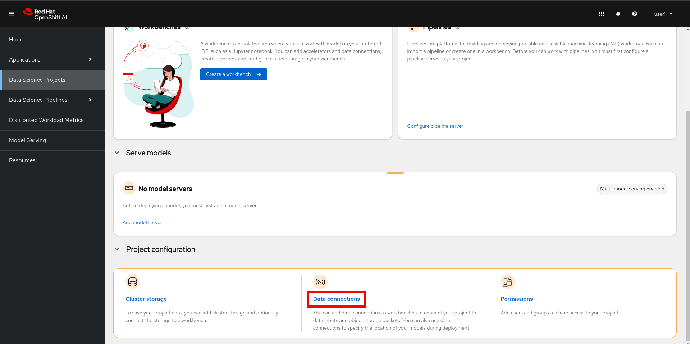

+++
title = "Préparation de l'environnement"
draft= false
weight= 2
[[ressources]]
  src = '**.png'
+++

## Introduction

Il est important de comprendre les principaux concepts que nous allons utiliser autour de l'IA.

* **OpenShift AI** est une plateforme intégrée qui facilite la gestion de projets d'IA dans un environnement cloud-natif basé sur OpenShift.
* Chaque participant travaillera dans un **Data Science Project**, qui sert d'espace isolé pour organiser ses ressources (données, notebooks, modèles, pipelines…).  
* Le **Workbench** fournit un environnement de développement interactif basé sur Jupyter, dans lequel les data scientists peuvent écrire, exécuter et tester leur code.  
* Le **Pipeline Server** est le moteur qui orchestre, automatise et suit l'exécution des différentes étapes des workflows de traitement des données et d'entraînement des modèles.  
* Une **Data Connection** permet de relier la plateforme à une source de stockage (par exemple S3 ou Ceph) afin de sauvegarder et partager les artefacts produits dans un Workbench ou un Pipeline. 
* Enfin, le **repository Git** contient le code source du projet, garantissant une bonne reproductibilité et favorisant la collaboration autour du même ensemble de scripts et de notebooks.

Ces composants travaillent ensemble pour fournir un processus complet de bout en bout, du développement expérimental jusqu'au déploiement des modèles.

## Connexion à un projet

1. Dans le tableau de bord OpenShift AI, naviguez vers le menu *Data Science Projects* sur la gauche :  

2. Un identifiant unique vous a été attribué au début de l'atelier. Un projet portant le **même nom** a été créé pour vous. Cliquez dessus pour l'ouvrir. Vous devriez arriver sur une page similaire :  

## Création d'une Data Connection

Nous avons déployé une instance Minio pour gérer le stockage objet dans le cluster. Vous devrez ajouter une Data Connection pointant vers ce stockage.

1. Faites défiler jusqu'au bas de la page du projet et cliquez sur *Data connections* :  

Pour l'instant, la page est vide.

2. Cliquez sur *Add data connection* et saisissez les informations suivantes :
- **Name** : `pipelines`
- **Access key** : `userX`  **⫷ REMPLACEZ PAR VOTRE IDENTIFIANT**
- **Secret key** : ``
- **Endpoint** : ``
- **Region** : `none`
- **Bucket** : `userX`  **⫷ REMPLACEZ PAR VOTRE IDENTIFIANT**

Le résultat devrait ressembler à ceci :  

3. Une fois le formulaire rempli, cliquez sur *Add data connection* pour valider.

## Création d'un Pipeline Server

Il est conseillé de créer dès maintenant le Pipeline Server, qui hébergera vos pipelines IA plus tard. C'est ce que nous allons faire maintenant :

1. Dans le menu en haut, ouvrez l'onglet *Pipelines* et cliquez ensuite sur *Configure pipeline server*.  

2. Dans le menu déroulant avec l'icône de clé, sélectionnez la Data Connection créée précédemment (nommée *pipelines*) pour remplir automatiquement le formulaire avec les informations enregistrées et cliquez sur le bouton *Configure pipeline server*.  

3. Attendez que le Pipeline Server termine sa création. Lorsque celui-ci est prêt, votre écran devrait ressembler à ceci :  

⚠️ Il est impératif d'attendre la fin de la création du Pipeline Server.

À ce stade, vous êtes connecté à votre Data Science Project, la Data Connection a été configurée pour le stockage et votre Pipeline Server est maintenant prêt et déployé pour les pipelines.
