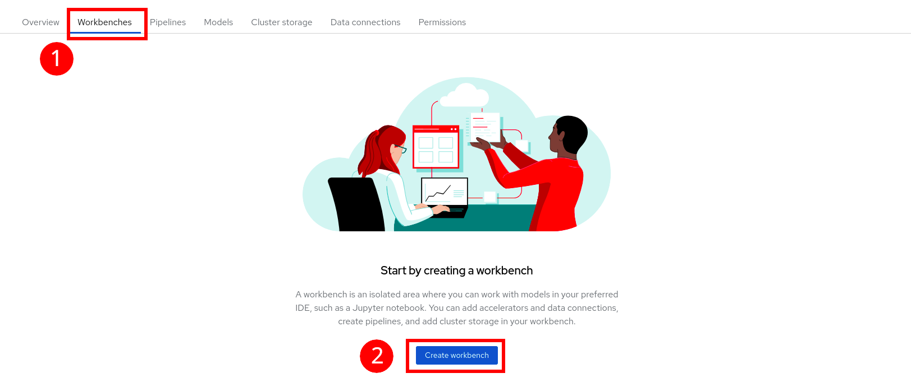
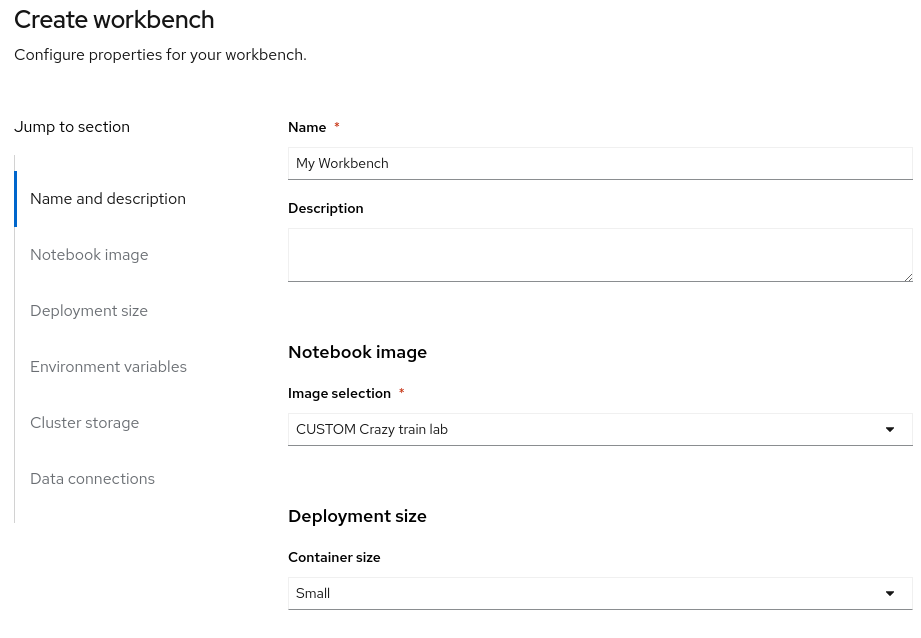
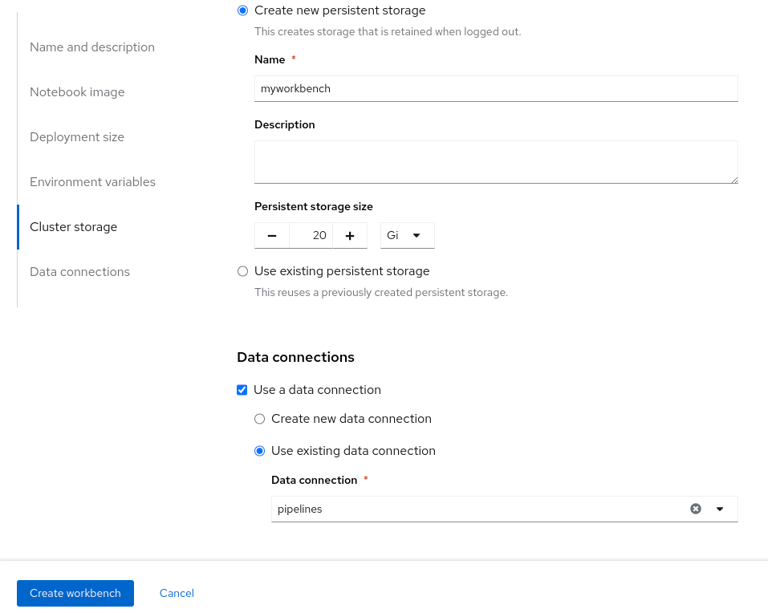
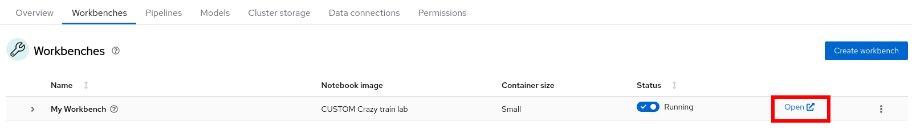
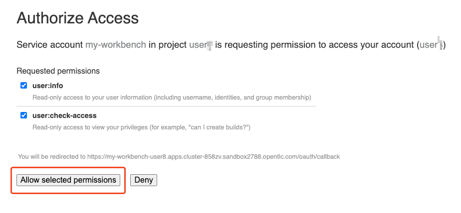
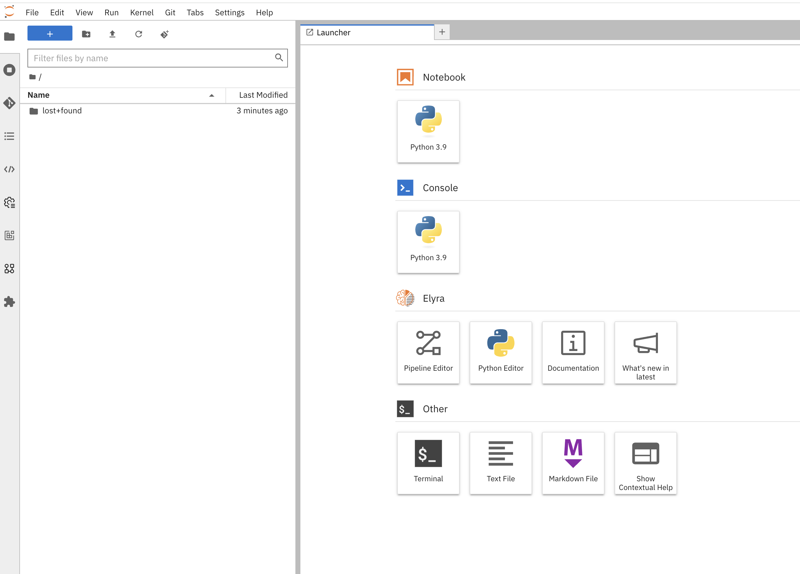
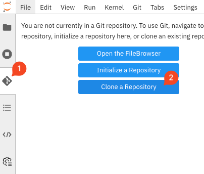
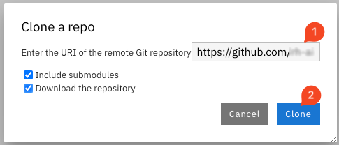

+++
title = "Workbench Creation"
draft= false
weight= 3
[[resources]]
  src = '**.png'
+++

## Launch a Workbench

* Once the Data Connection and Pipeline Server have been fully created, you can proceed to create the Workbench. Click on the `Workbenches` tab and then `Create workbench`.

* Make sure to fill in the following settings:  
    * Choose a name, for example: `My Workbench`  
    * Select the image: `CUSTOM Crazy train lab`  
    * Container size: `Small`  
    * Keep the default storage settings.  
    * At the bottom, check `Use a data connection`.  
    * Scroll down to `Use existing data connection`  
    * Select the `pipelines` Data Connection you created earlier from the list.  
    * It should look like this:  
  

* Click `Create workbench` to confirm and wait for its blue `Starting` status to turn green `Running`.

* Once the Workbench is created, click the `Open` link to connect to it.

* Authenticate using the same credentials as before.

* You will be asked to accept the following settings:

* Click on `Allow selected permissions`.

* You should now see this:

## Clone the Workshop Git Repository

We will clone the content of our Git repository so that you can access all the materials needed to train the AI model.

* Open the tab with the Git icon in the left menu and click `Clone a Repository`:  

* Enter the Git repository URL: ````. Also select `Download the repository` and confirm with `Clone`:  

At this stage, your Jupyter environment is ready for the work we want to do.
