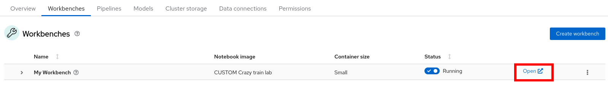
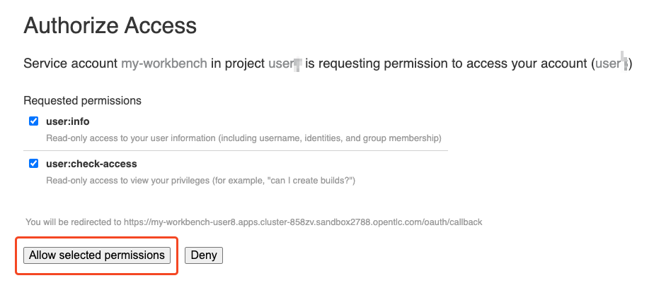
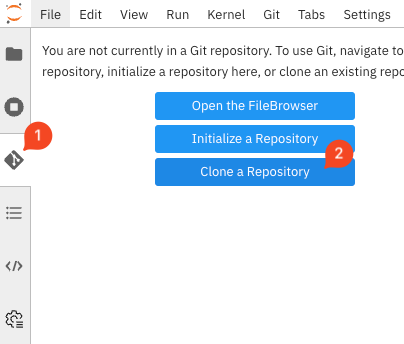

+++
title = "Création du Workbench"
draft= false
weight= 3
[[ressources]]
  src = '**.png'
+++

## Lancer un Workbench

Une fois la Data Connection et le Pipeline Server entièrement créés, vous pouvez passer à la création du Workbench, qui servira d'environnement principal pour le développement IA.

1. Cliquez sur l'onglet *Workbenches*, puis sur le bouton *Create workbench*.

2. Remplissez les paramètres suivants dans le formulaire :  
- **Name** : choisissez un nom, par exemple `My Workbench`  
- **Image selection** : sélectionnez *CUSTOM Crazy train lab*  
- **Container size** : sélectionnez *Small*  
- **Use a data connection** : cochez cette case, puis sélectionnez *Use existing data connection*. Dans la liste déroulante, choisissez la Data Connection *pipelines* que vous avez créée précédemment.
Le résultat devrait ressembler à ceci :  

3. Cliquez sur *Create workbench* pour valider, puis attendez que le statut bleu *Starting* devienne vert *Running*.

4. Une fois le Workbench créé, cliquez sur le lien *Open* pour y accéder.

5. Authentifiez-vous en utilisant les mêmes identifiants qu'auparavant.

6. Vous serez invité à accepter certains paramètres. Cliquez sur *Allow selected permissions*.  
  

Vous devriez maintenant voir l'interface suivante :  

## Cloner le repository Git

Nous allons cloner le contenu de notre repository Git afin que vous puissiez accéder à tout le matériel nécessaire pour l'entraînement du modèle d'IA.

1. Ouvrez l'onglet avec l'icône Git dans le menu de gauche et cliquez sur *Clone a Repository* :  

2. Entrez l'URL du repo Git : ````. Cochez également *Download the repository*, puis cliquez sur *Clone* :  

À ce stade, votre environnement Jupyter est prêt pour commencer le travail.

