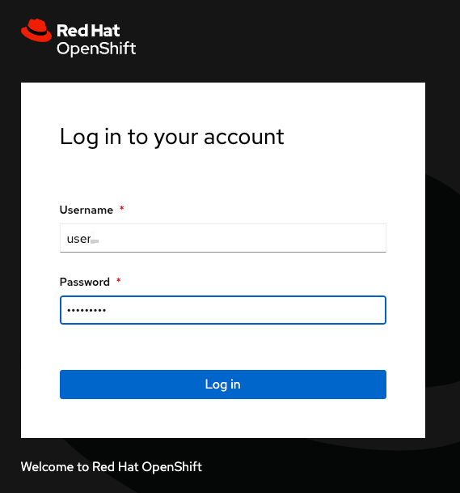
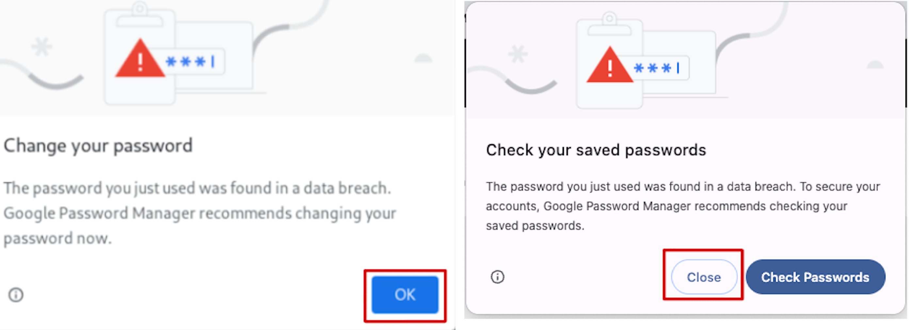
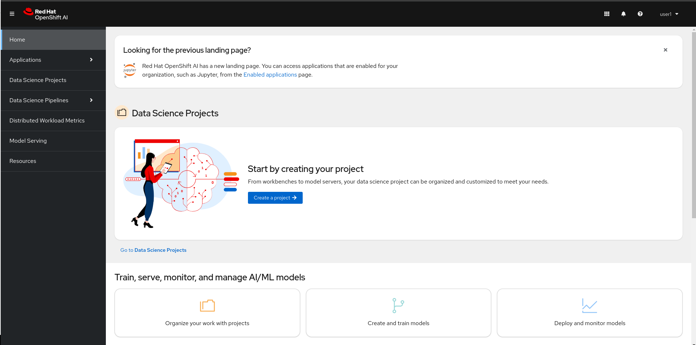

+++
title = "Connection"
draft= false
weight= 1
[[resources]]
  src = '**.png'
+++

## Environment Information

For the purposes of this workshop, we have provisioned a single OpenShift cluster with OpenShift AI deployed on it.  
Each participant has a unique user account to perform their work.

## Connecting to the Environment

1. In a new window or tab, open the OpenShift AI dashboard URL: [https://rhods-dashboard-redhat-ods-applications.apps.](https://rhods-dashboard-redhat-ods-applications.apps.).
2. Enter your credentials. The screen should look like this:  
  
3. Since the password is simple, your browser may display a warning:  
  
You can ignore this message if it appears.  
After authentication, the display should look like this:  

If you’ve made it this far, congratulations! You are now successfully logged in to the OpenShift AI dashboard.
