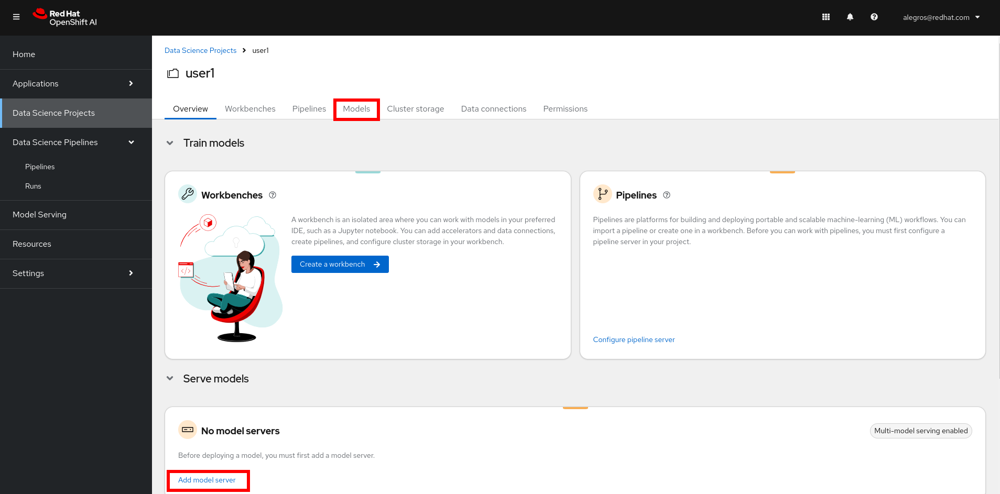
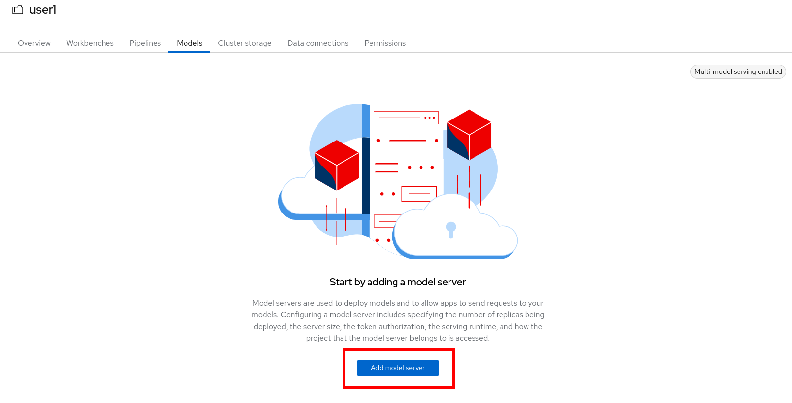
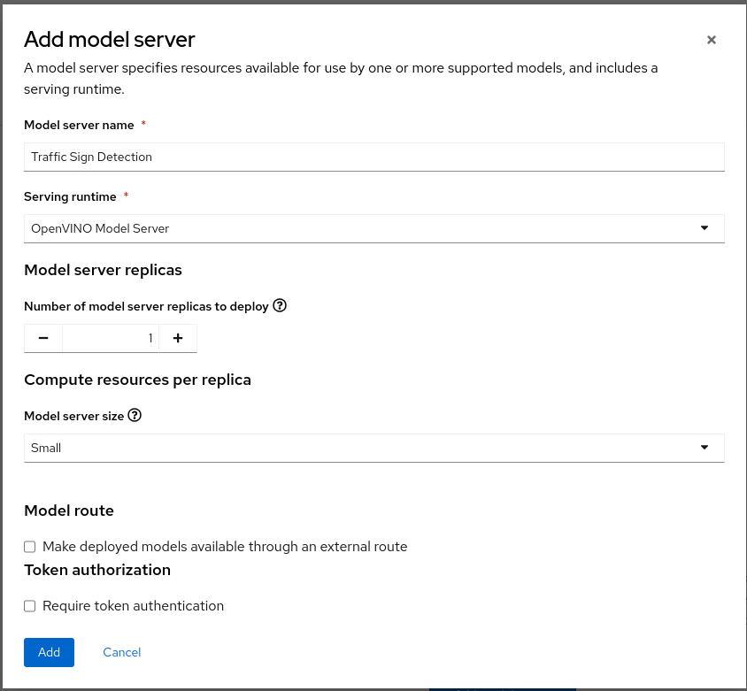
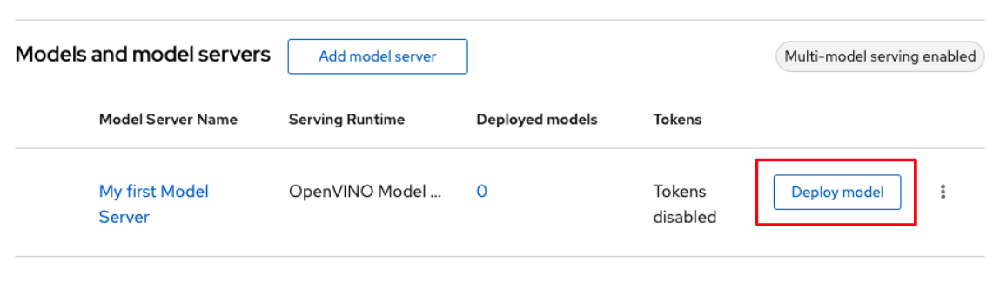
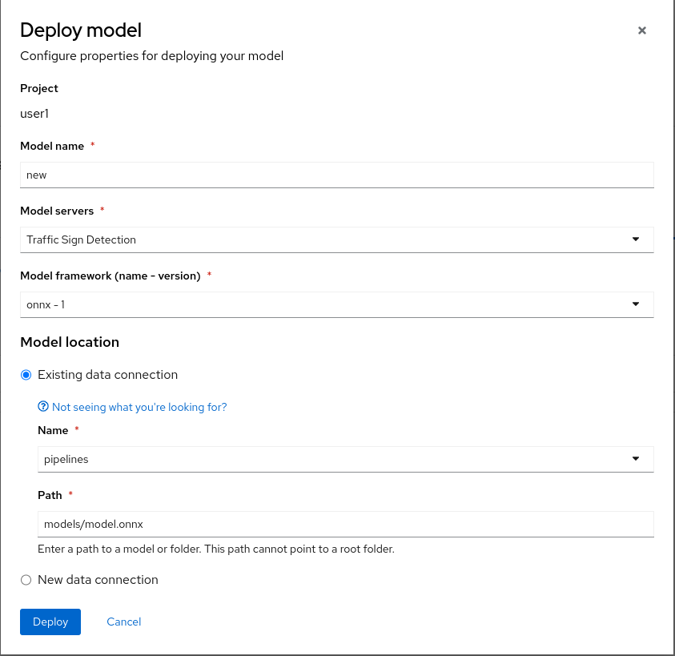
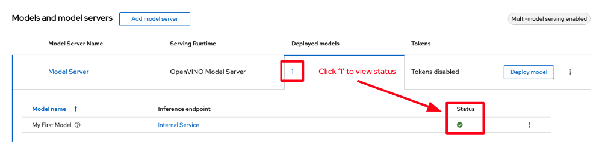
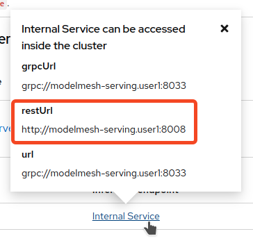

+++
title = "Model Serving"
draft= false
weight= 6
[[resources]]
  src = '**.png'
+++

In this section, you will deploy the model you just created to the OpenShift AI Model Server.

**Note**: If something went wrong during model training in the previous section, you can still follow this section starting with the first part titled **FALLBACK**.

## FALLBACK – You can skip this section if you successfully trained your model

1. In the OpenShift AI dashboard, open the left menu and click on *Data Science Projects*.

2. Click on the project corresponding to your username.

3. Select the *Data connections* tab.

4. Click *Add data connection* and enter the following information:
- **Name** :  
```Model Registry```
- **Access key** :  
```userX```  **⏪ REPLACE WITH YOUR USER ID**
- **Secret key** :  
``````
- **Endpoint** :  
``````
- **Region** :  
```none```
- **Bucket** :  
``````

## Create a Model Server

1. In the OpenShift AI dashboard, open the left menu and click on *Data Science Projects*.

2. Click on the project corresponding to your username.

3. Select the *Models* tab.


4. Click on *Add model server*


5. Enter the following information:
- **Model server name** : ``````
- **Serving runtime** : select *OpenVINO Model Server*
- **Number of model server replicas to deploy** : ```1```
- **Model server size** : select **
- **Model route** : unchecked
- **Token authentication** : unchecked

The result should look like this:


6. Click *Add* to create the model server.

## Deploy the Model

1. Under *Models and model servers*, to the right of the model server you just created, click *Deploy model*.


2. Enter the following information:
- **Model deployment name** : ``````
- **Model server** : `````` (should already be automatically selected)
- **Model framework (name - version)** : select *onnx - 1*
- **Existing data connection** - **Name** : select ** (or *Model Registry* for those who followed the FALLBACK section)
- **Existing data connection** - **Path** : `````` (or ```default/model.onnx``` for those who followed the FALLBACK section)

The result should look like this:


3. Click *Deploy* to start the model deployment.

4. Wait a few moments. If the model is successfully deployed, its status will turn green after a few seconds.


Now we will verify that the model is working correctly by querying it!

## Querying the Deployed Model

Once the model is served, we can use it as an endpoint that can receive requests. We send a REST (or gRPC) request to the model and receive a response. This endpoint can be used by applications or other services.

1. First, obtain the endpoint URL. To do this, click on the *Internal endpoint details* link in the *Inference endpoint* column.

2. In the popup that appears, you will see several URLs associated with our model server.


3. Copy the **restUrl**, which should look like `http://modelmesh-serving.{userX}:8008`. We will now use this URL to query the model.

4. Return to your Workbench, i.e., the Jupyter environment via the *Workbenches* tab.

5. Open the Notebook *inference/inference.ipynb*.

6. **Update the variable** *RestUrl* with the URL you copied previously to your clipboard.

7. Run all cells in the notebook using the double-arrow ▶▶ icon, and take a moment to observe the code execution.  
The *Base model detection* section queries the base model, deployed globally for all participants.  
The *New model detection* section uses the *RestUrl* endpoint to query the model you trained and deployed.  
You should notice that with the base model, only standard traffic signs are detected.  
After retraining, your model can now better recognize LEGO traffic signs. Congratulations!
