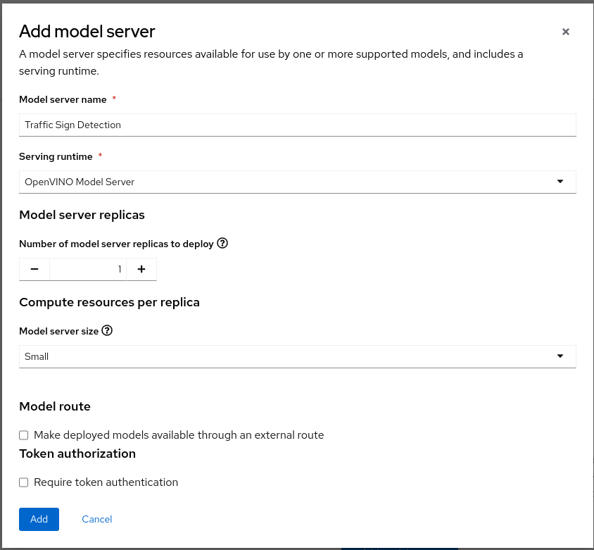
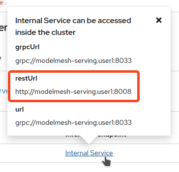

+++
title = "Déploiement du modèle"
draft= false
weight= 6
[[ressources]]
  src = '**.png'
+++

Dans cette section, vous allez déployer le modèle que vous venez de créer sur le serveur de modèles d'OpenShift AI.

**Remarque** : si quelque chose s'est mal passé lors de l'entraînement du modèle dans la section précédente, vous pouvez toujours suivre cette section en commençant par la première partie intitulée **Fallback**.

## Fallback – Vous pouvez passer cette section si vous avez entraîné votre modèle avec succès

1. Dans le tableau de bord OpenShift AI, ouvrez le menu de gauche et cliquez sur *Data Science Projects*.

2. Cliquez sur le projet correspondant à votre nom d'utilisateur.

3. Sélectionnez l'onglet *Data Connection*.

4. Cliquez sur *Add data connection* et saisissez les informations suivantes :
- **Name** :  
```Model Registry```
- **Access key** :  
```userX```  **⏪ REMPLACEZ PAR VOTRE IDENTIFIANT**
- **Secret key** :  
``````
- **Endpoint** :  
``````
- **Region** :  
```none```
- **Bucket** :  
``````

## Créer un serveur de modèle

Dans votre projet, créez un serveur de modèle. Vous pouvez cliquer ici pour voir tous les modèles déployés :


* Cliquez sur **Add model server**


* Voici les informations que vous devez entrer :

- Model server name: ``````
- Serving runtime: ```OpenVINO Model Server```
- Number of model server replicas to deploy: ```1```
- Model server size ``````
- Model route ```unchecked```
- Token authorization ```unchecked```

* Le résultat devrait ressembler à ceci:


* Vous pouvez cliquer sur **Add** pour créer le serveur de modèle.

## Déployer le modèle

Dans votre projet, sous **Models and model servers**, sélectionnez **Deploy model**.

* Cliquez sur **Déployer le modèle**


* Voici les informations que vous devrez entrer. **Si vous avez suivi le fallback, veuillez remplacer la "Existing data connection - Name" par le nom de la "Data Connection" que vous avez créée (Model Registry)**:

    - Model name: ``````
    - Model server: ``````
    - Model server - Model framework: ```onnx-1```
    - Existing data connection - Name: `````` - **FOR FALLBACK track: use ```Model Registry```**
    - Existing data connection - Path: ``````

* Le résultat devrait ressembler à ceci


* Cliquez sur **Deploy model**.
* Si le modèle est déployé avec succès, vous verrez son statut en vert après quelques secondes.


Nous allons maintenant confirmer que le modèle fonctionne bien en l'interrogeant !

## Interroger le modèle deployé

Une fois que le modèle est servi, nous pouvons l'utiliser comme un endpoint qui peut être requêté. Nous envoyons une requête REST ou gRPC au modèle et obtenons un résultat. Cela s'applique à toute personne travaillant au sein de notre cluster. Il peut s'agir de collègues ou d'applications.

* Tout d'abord, nous devons obtenir l'URL du serveur de modèle.
* Pour ce faire, cliquez sur le lien **Internal Service** dans la colonne **Inference endpoint**.
* Dans le popup, vous verrez quelques URLs pour notre serveur de modèle.


* Notez ou copiez le **RestUrl**, qui devrait être quelque chose comme `http://modelmesh-serving.{userX}:8008`

Nous allons maintenant utiliser cette URL pour interroger le modèle. Retournez dans votre workbench, c'est-à-dire dans l'environnement jupyter notebooks.

- Dans votre workbench, naviguez vers le notebook `inference/inference.ipynb`. **Mettez à jour la variable** "RestUrl" avec l'url copié précédemment dans votre presse papier.
- Exécutez les cellules du notebook, et assurez-vous que vous comprenez ce qui se passe.

La première section interroge le modèle de base qui a été déployé globalement pour tout le monde. La deuxième section prend endpoint RestUrl et interroge le modèle que vous avez formé et déployé. Vous devriez constater qu'avec le modèle de base, seuls les panneaux de signalisation de limitation de vitesse sont reconnus. Après le réapprentissage du modèle, vous avez maintenant un modèle qui peut mieux détecter les panneaux de signalisation Lego. Félicitations !
