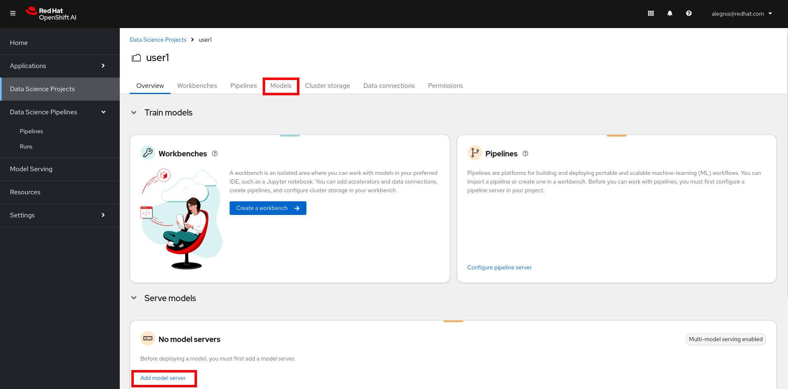
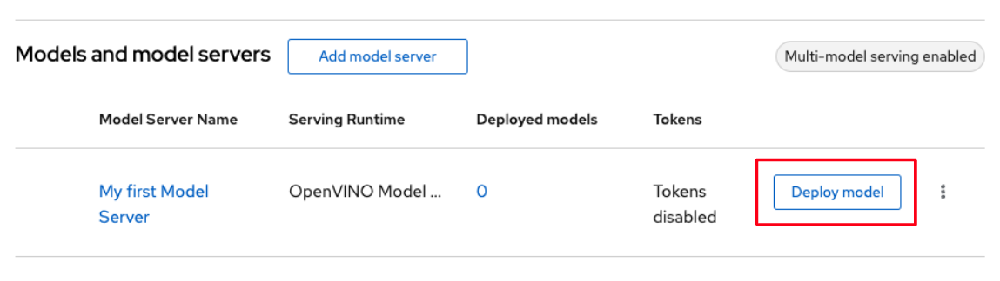

+++
title = "Déploiement du modèle"
draft= false
weight= 6
[[ressources]]
  src = '**.png'
+++

Dans cette section, vous allez déployer le modèle que vous venez de créer sur le serveur de modèles d'OpenShift AI.

**Remarque** : si quelque chose s'est mal passé lors de l'entraînement du modèle dans la section précédente, vous pouvez toujours suivre cette section en commençant par la première partie intitulée **FALLBACK**.

## FALLBACK – Vous pouvez passer cette section si vous avez entraîné votre modèle avec succès

1. Dans le tableau de bord OpenShift AI, ouvrez le menu de gauche et cliquez sur *Data Science Projects*.

2. Cliquez sur le projet correspondant à votre nom d'utilisateur.

3. Sélectionnez l'onglet *Data connections*.

4. Cliquez sur *Add data connection* et saisissez les informations suivantes :
- **Name** : `Model Registry`
- **Access key** : `userX`  **⫷ REMPLACEZ PAR VOTRE IDENTIFIANT**
- **Secret key** : ``
- **Endpoint** : ``
- **Region** : `none`
- **Bucket** : ``

## Créer un serveur de modèles

1. Dans le tableau de bord OpenShift AI, ouvrez le menu de gauche et cliquez sur *Data Science Projects*.

2. Cliquez sur le projet correspondant à votre nom d'utilisateur.

3. Sélectionnez l'onglet *Models*.

4. Cliquez sur *Add model server*

5. Saisissez les informations suivantes :
- **Model server name** : ``
- **Serving runtime** : sélectionnez *OpenVINO Model Server*
- **Number of model server replicas to deploy** : `1`
- **Model server size** : sélectionnez **
- **Model route** : décoché
- **Token authentication** : décoché

Le résultat devrait ressembler à ceci :

6. Cliquez sur *Add* pour valider la création du serveur de modèles.

## Déployer le modèle

1. Sous *Models and model servers*, à droite du serveur de modèles que vous venez de créer, cliquez sur *Deploy model*.

2. Saisissez les informations suivantes :
- **Model deployment name** : ``
- **Model server** : ``, qui devrait déjà être automatiquement sélectionné
- **Model framework (name - version)** : sélectionnez *onnx - 1*
- **Existing data connection** - **Name** : sélectionnez ** (ou *Model Registry* si vous avez suivi la section FALLBACK)
- **Existing data connection** - **Path** : `` (ou `default/model.onnx` si vous avez suivi la section FALLBACK)

Le résultat devrait ressembler à ceci :

3. Cliquez sur *Deploy* pour valider le déploiement du modèle.

4. Patientez quelques instants. Si le modèle est déployé avec succès, son statut passera au vert après quelques secondes.

Nous allons maintenant vérifier que le modèle fonctionne correctement en l'interrogeant !

## Interroger le modèle deployé

Une fois que le modèle est servi, nous pouvons l'utiliser comme un endpoint pouvant recevoir des requêtes. Nous envoyons une requête REST (ou gRPC) au modèle et recevons un résultat. Ce endpoint peut être utilisé par des applications ou d'autres services.

1. Tout d'abord, récupérez l'URL de l'endpoint. Pour cela, cliquez sur le lien *Internal endpoint details* dans la colonne *Inference endpoint*.

2. Dans le popup qui s'affiche, vous verrez plusieurs URLs associées à notre serveur de modèles.

3. Copiez le **restUrl**, qui devrait ressembler à `http://modelmesh-serving.{userX}:8008`. Nous allons maintenant utiliser cette URL pour envoyer des requêtes au modèle.

4. Retournez dans votre Workbench, c'est-à-dire dans l'environnement Jupyter, via l'onglet *Workbenches*.

5. Ouvrez le Notebook *inference/inference.ipynb*.

6. **Mettez à jour la variable** *RestUrl* avec l'URL que vous avez copiée précédemment dans votre presse-papiers.

7. Exécutez toutes les cellules du notebook en utilisant l'icône à double flèche ▶▶, et prenez le temps d'observer le fonctionnement du code.  
La section *Base model detection* interroge le modèle de base, déployé globalement pour tous les participants.  
La section *New model detection* utilise l'endpoint *RestUrl* pour interroger le modèle que vous avez entraîné et déployé.

Vous devriez constater qu'avec le modèle de base, seuls les panneaux de signalisation standard sont détectés.  
Après le réentraînement, votre modèle est désormais capable de mieux reconnaître les panneaux de signalisation LEGO. Félicitations !
