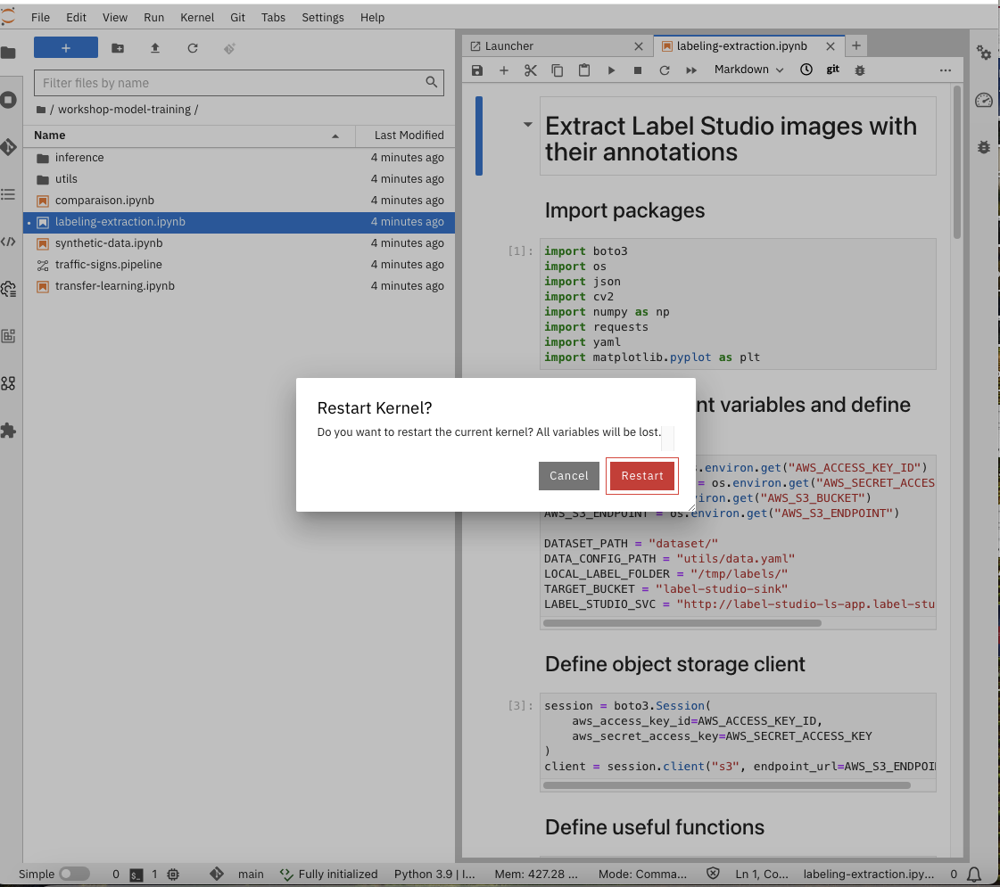
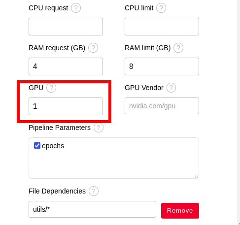
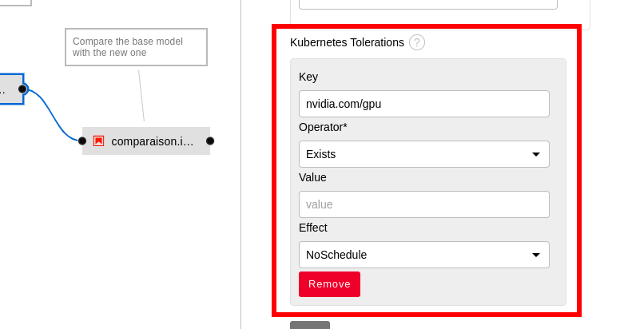
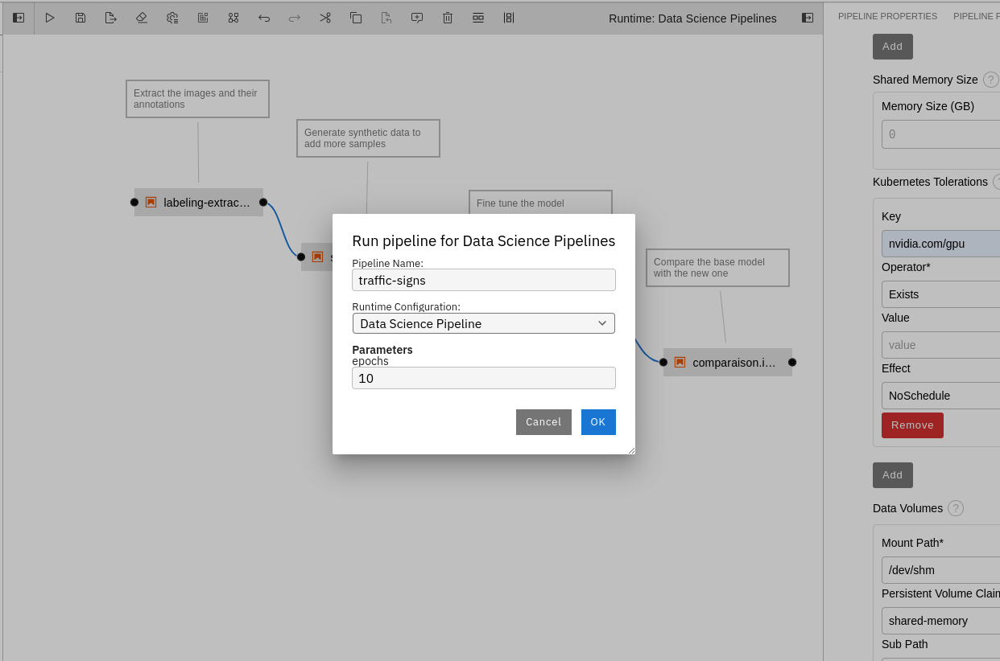
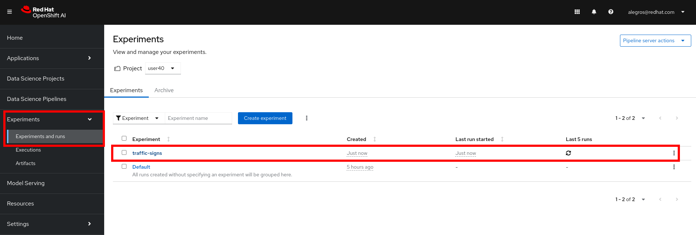

+++
title = "Model Training"
draft= false
weight= 4
[[resources]]
  src = '**.png'
+++

In this section, you will:  
- Explore the Python code used to retrain the model.  
- Automate the execution of the different steps using a Pipeline.  
- Visualize the Pipeline and its results in the OpenShift AI dashboard.

⚠️ **WARNING**:  
You will only run the initial steps of model training in the Jupyter development environment.  
The full training will be executed outside of Jupyter via a Pipeline to avoid an **OOM Killed** error (insufficient memory).  
If an error occurs, your pod will be automatically deleted and recreated. Nothing serious, but your development environment will be temporarily unavailable for a few minutes.

## Navigating the Model Training Code

You have previously cloned a Git repository. In the file browser on the left, you should see a folder named after the Git project: **.

1. Click on ** to open the folder. Inside, you will find several items:
  * The *utils/* folder contains utility functions and dependencies for model training, such as Python functions or mappers.  
  * The *inference/* folder contains resources for querying models after deployment. We will use it later.  
  * The *traffic-signs.pipeline* file is a Data Science Pipeline generated with Elyra. **Elyra** provides a graphical interface that allows you to drag-and-drop Notebooks or Python scripts for each step and link them together to create workflows. You will be able to run this Pipeline on OpenShift via the GUI.  
  * The *labeling-extraction.ipynb* Notebook retrieves images annotated with Label Studio. It downloads both the images and the corresponding annotations with **bounding boxes**.  
  * The *synthetic-data.ipynb* Notebook generates random synthetic data to enrich the model training dataset.  
  * The *transfer-learning.ipynb* Notebook contains the model training code itself.  
  * The *comparison.ipynb* Notebook compares the base model (which does not recognize LEGO traffic signs) with the model you will train (which should hopefully recognize them). This ensures that no regression is introduced during retraining.

### Extracting Images and Annotations

1. Click on *labeling-extraction.ipynb* and explore the Notebook content.

2. Run the entire Notebook using the double-arrow icon in the top toolbar. Click *Restart* when prompted:  

You may notice that these scripts created a *dataset* directory. This directory contains two subfolders: *images* and *labels*, which contain the images and corresponding annotations, respectively.

3. In the same Notebook, scroll to the section *Select a random image and display its bounding boxes* and rerun the cell by clicking it and then the arrow icon in the top toolbar.  
This cell selects a random image from *dataset/images* and overlays the rectangles corresponding to the annotations saved in *dataset/labels*.

### Generating Synthetic Data

1. Open the *synthetic-data.ipynb* Notebook.  
This Notebook generates random **synthetic data** to supplement the model training dataset.

2. Run the entire Notebook as explained previously. Take time to review the code and observe the visualization examples.

3. You can rerun the visualization step to display other examples of synthetic data.

### Examining the Model Training Step

⚠️ **Do NOT run this Notebook!** Executing it could crash your environment, as the RAM available per participant is limited.  

Simply open the *transfer-learning.ipynb* Notebook and review the code to understand its functionality.

### Examining the Comparison Step

⚠️ **Do NOT run this Notebook!** Executing it could crash your environment, as the RAM available per participant is limited.  

Simply open the *comparison.ipynb* Notebook and review the code to understand its functionality.

## Running the Data Science Pipeline

In this step, you will prepare the Data Science Pipeline to use a **GPU** to accelerate model training. On OpenShift, a few small shared GPUs have been deployed and will be used to run this Pipeline.

1. Open the *traffic-signs.pipeline* Pipeline.  
You will see the Elyra graphical interface, which allows creating and running Data Science Pipelines. Our Pipeline was built by drag-and-dropping the Notebooks from the file explorer on the left.

### Completing the Pipeline

This Pipeline has 4 steps and 2 connections, but it is missing a connection between the third step (*transfer-learning*) and the fourth (*comparison*).  

To create this connection:  
1. Click the black dot on the right of the third step (*transfer-learning*).  
2. Hold and drag it to the black dot on the left of the fourth step (*comparison*).  
You should get the completed Pipeline as shown:

### Examining Step Properties

1. Right-click the second step of the Pipeline (*synthetic-data*).  
2. In the menu, click *Open Properties*. Properties appear in the right panel.  
3. Scroll down to see the main properties:  
- **Runtime Image**: container image used to execute the Python code for this step.  
- **CPU request**: amount of CPU reserved for this step.  
- **RAM limit**: maximum RAM allowed for this step.  
- **Pipeline Parameters**: globally declared Pipeline parameters that can be enabled for this step.  
- **File Dependencies**: files required during execution inside the container. Here, the entire *utils/* directory is required.  
- **Output Files**: files generated during execution, accessible by subsequent steps.  
- **Kubernetes Secrets**: secrets mounted in the container. Here, object storage credentials are available as environment variables during execution.

At the top of the properties panel, you will find three tabs: *Pipeline Properties*, *Pipeline Parameters*, and *Node Properties*. Feel free to explore them.

### Requesting a GPU for the *transfer-learning* Step

1. Close the properties panel of the previous step.  

2. Now modify the **third step** of the Pipeline (*transfer-learning*). Do not touch the previous step.  
Right-click the third step (*transfer-learning*) and select *Open Properties*. Properties appear in the right panel.

3. Locate the *GPU* property and enter `1` to request a GPU for model training.  

4. Scroll to the bottom of the configuration panel.  
Nodes with GPUs have **taints**, which by default prevent containers from running on them. To allow this step to use a GPU, add a **toleration**:  
Click *Add* under *Kubernetes Tolerations* and fill in the fields as follows:
- **Key**: `nvidia.com/gpu`  
- **Operator**: *Exists*  
- **Effect**: *NoSchedule*

5. At the end, your configuration should look like this:  

### Running the Pipeline

Now it's time to run the Pipeline on OpenShift AI.  

1. Click the *Run Pipeline* button (arrow icon) in the top toolbar:  

2. If a popup warns that the Pipeline is unsaved, click *Save and Submit*.

3. In the Pipeline configuration, set the value `10` for the *epochs* parameter.  
  
An **epoch** corresponds to one full pass of the algorithm over the training dataset.  
Choosing the **number of epochs** is crucial for good performance:
- Too few epochs: the model will not have learned enough and will remain ineffective.  
- Too many epochs: the model may **overfit**, meaning it becomes too close to the training data and fails to generalize to new data.

4. After a few moments, a success popup will appear. Click *Run Details* to view the Pipeline execution details.  

## Viewing Your Results

### Checking Pipeline Runs

1. **If you missed the shortcut in the Elyra popup**, follow these steps to locate your Pipeline execution info. Otherwise, skip to the next step.  

   1a. Go back to the OpenShift AI dashboard:  
   [https://rhods-dashboard-redhat-ods-applications.apps.](https://rhods-dashboard-redhat-ods-applications.apps.)

   1b. In the left menu, click *Experiments*, then *Experiments and runs*.

2. Select the experiment associated with your Pipeline.  
   If you kept the default name, it is called *traffic-signs* and appears first.  
   

3. Click the current run to view the execution status. It usually appears first in the list, with the same name as the Pipeline plus a number.

4. Clicking a Pipeline step opens a side panel on the right showing details, including *logs* in the *Logs* tab.

5. Select *Main* from the dropdown to see the logs from the main container for that step.  

6. Wait until all Pipeline steps are complete and marked in green.  
You should get a result similar to this:  

### Retrieving Pipeline Outputs

All Pipeline outputs are saved in **MinIO** object storage.

1. Click this link to the MinIO console: []().  

2. Log in with the same username assigned at the start of the workshop. The password is ``.

3. You should see several buckets. Click the one matching your username:  
   - You will find a *results.csv* file containing metrics from model training, which you can download.  
   - You will also find a folder corresponding to your Pipeline, starting with *traffic-sign*.

4. Open this folder. You will find HTML files, Notebooks (*.ipynb*), and archives.

5. Click the *comparison.html* file. A menu will appear on the right. Click *Download* and open the file locally in your browser.  
Compare the base model results with the new model. In this example, we lost some accuracy on classical traffic signs in the original dataset, but the new model can now detect LEGO signs that were previously unrecognized.
  

