+++
title = "Réentraînement du modèle"
draft= false
weight= 4
[[ressources]]
  src = '**.png'
+++

Dans cette section, vous explorerez le code Python utilisé pour réentraîner le modèle. Vous adapterez ensuite un pipeline de Data Science afin de l’exécuter sur OpenShift. Enfin, vous pourrez visualiser votre pipeline dans le tableau de bord OpenShift AI et récupérer ses résultats.

ATTENTION : Vous ne lancerez que les premières étapes de l’entraînement du modèle dans les notebooks Jupyter. L’entraînement complet se fera sur OpenShift afin de limiter la mémoire RAM utilisée par chaque participant. Sinon, l’exécution du modèle (dans *transfer-learning.ipynb*) risque d’échouer avec une erreur OOM Killed (mémoire insuffisante). Dans ce cas, votre pod OpenShift sera automatiquement supprimé et recréé. Rien de grave, mais votre environnement sera indisponible pendant environ une minute.

## Naviguer dans le code

Vous avez précédemment cloné un repository Git. Dans le navigateur de fichiers à gauche, vous devriez voir un dossier portant le même nom que le projet Git : **.

1. Cliquez dessus pour ouvrir le dossier.  
À l’intérieur, vous trouverez plusieurs éléments :
- Le dossier *utils/* contient des fonctions utilitaires et des dépendances pour l’entraînement du modèle, comme des fonctions Python ou des mappers.  
- Le dossier *inference/* contient du matériel pour interroger les modèles après leur déploiement. Nous l’utiliserons plus tard.  
- Le fichier *traffic-signs.pipeline* est un pipeline de Data Science généré avec Elyra. **Elyra** fournit une interface graphique qui permet de glisser-déposer des notebooks ou des scripts Python pour chaque étape et de les relier entre elles pour créer des workflows. Vous pourrez exécuter ce pipeline sur OpenShift via l’interface graphique.  
- Le notebook *labeling-extraction.ipynb* récupère les images annotées avec Label Studio. Il télécharge à la fois les images et les objets correspondants étiquetés avec des bounding boxes.  
- Le notebook *synthetic-data.ipynb* génère des données synthétiques aléatoires pour enrichir l’ensemble de données d’entraînement.  
- Le notebook *transfer-learning.ipynb* contient le code d’entraînement du modèle lui-même.  
- Le notebook *comparison.ipynb* compare le modèle de base (qui ne reconnaît pas les panneaux de signalisation LEGO) avec celui que vous allez entraîner (qui, espérons-le, les reconnaît). L’objectif est de s’assurer qu’aucune régression n’est introduite lors du réentraînement du modèle.

### Extraire les images et leurs annotations

1. Cliquez sur *labeling-extraction.ipynb* et parcourez le contenu du Notebook.

2. Exécutez le Notebook en entier en utilisant l’icône à double flèche dans la barre d’outils en haut. Cliquez sur *Restart* lorsqu’on vous le demande (voir ci-dessous) :  
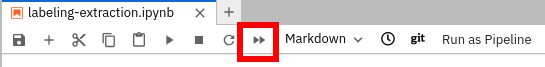
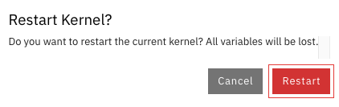
Vous avez peut-être remarqué que ces scripts ont créé un répertoire *dataset*. Ce répertoire contient deux sous-dossiers : *images* et *labels*, qui regroupent respectivement les images et les annotations correspondantes.

3. Dans le même Notebook, descendez à la section *Select a random image and display its bounding boxes* et réexécutez la cellule en cliquant dessus, puis sur l’icône flèche dans la barre d’outils en haut. 
Cette cellule sélectionne une image aléatoire dans le dossier *dataset/images* et superpose les rectangles correspondant aux annotations sauvegardées dans *dataset/labels*.

### Générer des données synthétiques

1. Ouvrez le notebook *synthetic-data.ipynb*.  
Ce notebook génère des données synthétiques de manière aléatoire, c’est-à-dire des données artificielles qui viendront compléter l’ensemble d’entraînement du modèle.  

2. Exécutez l’intégralité du Notebook comme expliqué précédemment. Prenez le temps de parcourir le code et d’observer les exemples affichés dans les sections de visualisation.

3. Vous pouvez relancer l’étape de visualisation pour afficher d’autres exemples de données synthétiques.

### Examiner l’étape d’apprentissage du modèle

⚠️ **Ne lancez pas ce Notebook !** Son exécution ferait crasher votre environnement, car la RAM disponible par participant est limitée.  

Ouvrez simplement le notebook *transfer-learning.ipynb* et parcourez le code pour en comprendre le fonctionnement.

### Examiner l’étape de comparaison

⚠️ **Ne lancez pas ce Notebook !** Son exécution ferait crasher votre environnement, car la RAM disponible par participant est limitée.  

Ouvrez simplement le notebook *comparison.ipynb* et parcourez le code pour en comprendre le fonctionnement.

## Adapter le pipeline de Data Science

Dans cette étape, vous allez préparer le pipeline de Data Science pour qu’il utilise un GPU afin d’accélérer l’entraînement du modèle. Sur OpenShift, quelques petits GPU partagés ont été déployés et seront utilisés pour exécuter ce pipeline.

1. Ouvrez le pipeline *traffic-signs.pipeline*.  
Vous verrez l’interface graphique d’Elyra, qui permet de créer et d’exécuter des pipelines de Data Science. Notre pipeline a été construit en glissant-déposant les notebooks depuis l’explorateur de fichiers situé à gauche.

### Compléter le pipeline

Ce pipeline comporte 4 étapes et 2 liaisons, mais il manque une connexion entre la troisième étape (*transfer-learning*) et la quatrième (*comparison*).  

Pour créer cette liaison :  
1. Cliquez sur le point noir à droite de la troisième étape (*transfer-learning*).  
2. Maintenez le clic et faites glisser jusqu’au point noir à gauche de la quatrième étape (*comparison*).  

Vous devriez obtenir le pipeline complet suivant :
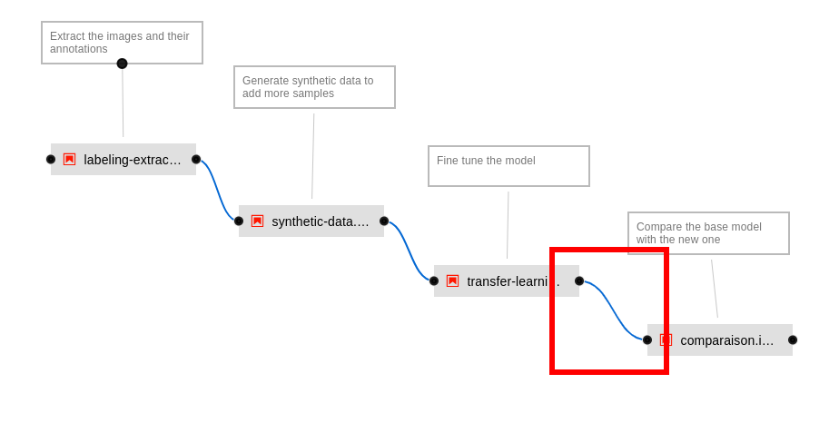

### Examiner les propriétés d’une étape

1. Cliquez avec le bouton droit sur la deuxième étape du pipeline (*synthetic-data*).  
2. Dans le menu qui s’ouvre, cliquez sur *Open Properties*. Les propriétés s’affichent dans le panneau de droite.  
3. Faites défiler vers le bas pour observer les principales propriétés :  
- **Runtime Image** : l’image du conteneur utilisée pour exécuter le code Python associé à cette étape.  
- **CPU request** : la quantité de CPU réservée pour cette étape.  
- **RAM limit** : la quantité maximale de RAM autorisée pour cette étape.  
- **Pipeline Parameters** : les paramètres de pipeline déclarés globalement, que l’on peut activer pour les rendre disponibles pour cette étape.  
- **File Dependencies** : les fichiers nécessaires à l’exécution dans le conteneur. Ici, tout le répertoire *utils/* est requis.  
- **Output Files** : les fichiers générés pendant l’exécution, accessibles aux étapes suivantes.  
- **Kubernetes Secrets** : les secrets montés dans le conteneur. Ici, les informations d’accès au stockage objet sont disponibles comme variables d’environnement pendant l’exécution.

En haut du panneau des propriétés, vous trouverez trois onglets : *Pipeline Properties*, *Pipeline Parameters* et *Node Properties*. N’hésitez pas à naviguer entre eux pour explorer les différents paramètres disponibles.

### Demander un GPU pour l'étape *transfer-learning*

1. Fermez les propriétés ouvertes à l'étape précédente.  
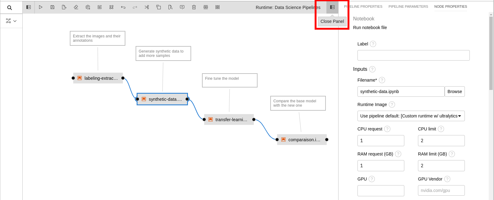

2. Nous allons maintenant modifier la **troisième étape** du pipeline (*transfer-learning*). Assurez-vous de ne pas toucher aux propriétés de l'étape précédente.  
Faites un clic droit sur la troisième étape (*transfer-learning*) et sélectionnez *Open Properties*. Les propriétés s’affichent dans le panneau de droite.

3. Cherchez la propriété *GPU* et saisissez `1` pour demander un GPU pour l’entraînement du modèle.  
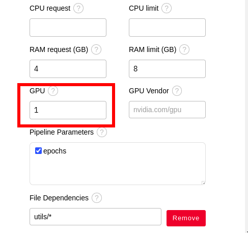

4. Descendez jusqu’en bas du panneau de paramétrage.  
Les noeuds contenant des GPU ont des **taints**, ce qui empêche par défaut l’exécution de conteneurs dessus. Pour permettre à cette étape d’utiliser un GPU, il faut ajouter une **toleration**.  
Cliquez sur *Add* sous la propriété *Kubernetes Tolerations* et remplissez les champs comme suit :
- **Key** : `nvidia.com/gpu`
- **Operator** : *Exists*
- **Effect** : *NoSchedule*

5. À la fin, votre configuration devrait ressembler à ceci :  
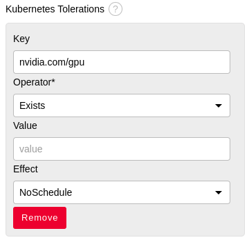

## Exécuter le pipeline

Il est maintenant temps de lancer le pipeline sur OpenShift.  

1. Cliquez sur le bouton *Run Pipeline* en forme de flèche dans la barre d’outils en haut :  
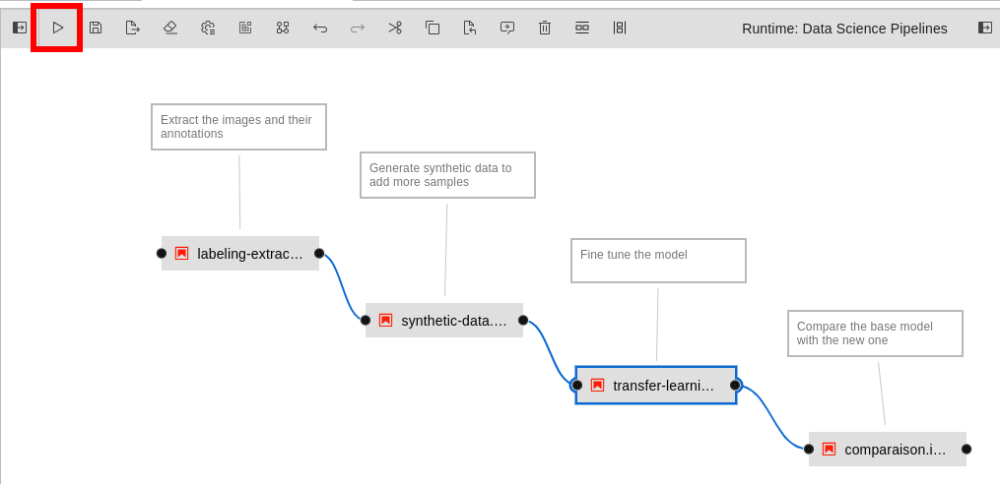

2. Si un popup apparaît vous avertissant que le pipeline n’est pas sauvegardé, cliquez sur *Save and Submit*.

3. Dans la configuration du pipeline, renseignez la valeur `10` pour le paramètre *epochs*.
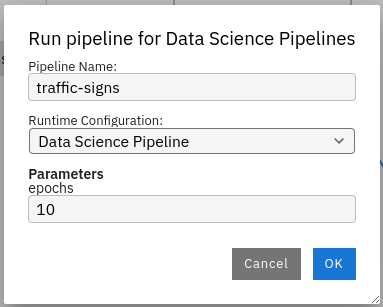
Une *epoch* correspond à un passage complet de l’algorithme sur l’ensemble du dataset d’entraînement.  
Le choix du nombre d’epochs est essentiel pour obtenir de bonnes performances :
- Trop peu d’epochs : le modèle n’aura pas suffisamment appris et restera inefficace.  
- Trop d’epochs : le modèle risque de faire de l’**overfitting**, c’est-à-dire d’être trop proche des données d’entraînement et de mal généraliser sur de nouvelles données.  

4. Après quelques instants, un popup de succès s’affichera. Cliquez sur *Run Details* pour consulter les informations d'exécution du pipeline.  
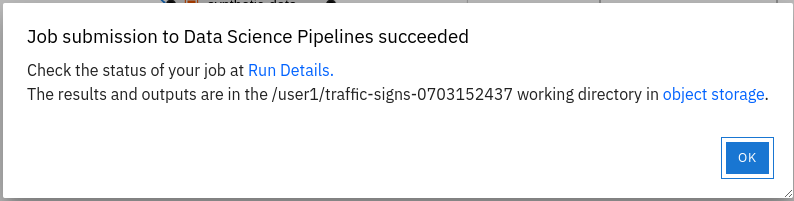

## Visualiser vos pipelines

### Récupérer les exécutions de pipelines

**Si vous avez manqué le raccourci** de la fenêtre popup d'elyra, suivez ces étapes pour récupérer votre pipeline. Sinon, passez au paragraphe suivant.
Vous pouvez maintenant retourner au tableau de bord d'Openshift AI : [https://rhods-dashboard-redhat-ods-applications.apps.](https://rhods-dashboard-redhat-ods-applications.apps.)
Sur le côté gauche **cliquez sur "Experiments", puis sur "Experiments and runs"**. Choisissez l'expérimentation associée au nom de votre pipeline. 
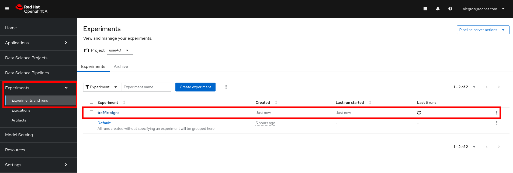
**Cliquer sur le run en cours**. Vous pouvez voir ici l'exécution du pipeline. Un run devrait être visible puisque vous en avez créé un dans la section précédente. Cliquez dessus.

Vous pouvez voir le statut de votre pipeline. Si vous cliquez sur un nœud, il affiche des informations telles que le panneau "Logs". Si vous sélectionnez le conteneur "Main" dans ce panneau, vous verrez les logs associés à l'exécution des notebooks :
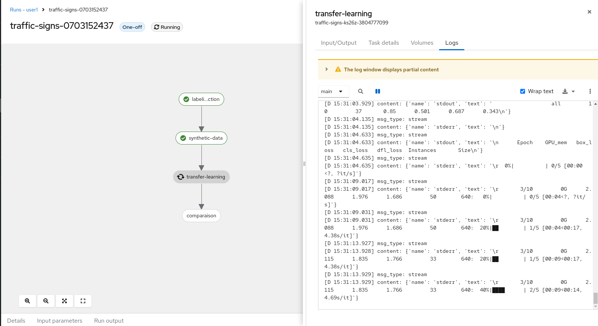

Attendez que le pipeline se termine. Vous devriez avoir quelque chose comme ça :
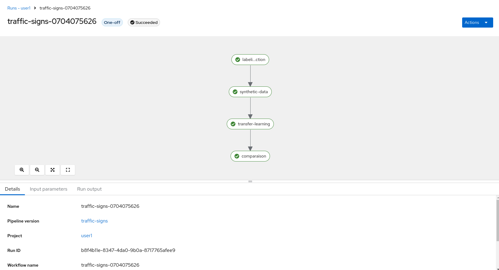

## Récupérer les output des pipelines

Toutes les output du pipeline sont sauvegardées dans le stockage objet. Connectez-vous à la console S3 en utilisant ce lien : [](). **Connectez-vous avec le même nom d'utilisateur** que nous vous avons donné au début du lab. **Le mot de passe est ````**. Vous devriez voir plusieurs buckets. Cliquez sur celui qui correspond à votre nom d'utilisateur. Il devrait y avoir un fichier *results.csv* dans lequel se trouve les métriques liées à l'entrainement du modèle que vous pouvez télécharger si vous le souhaitez. Il devrait également y avoir un répertoire qui correspond à votre pipeline. Il commence par "traffic-sign". Ouvrez-le. Vous y trouverez des fichiers html, ipynb et des archives. Cliquez sur le fichier *comparison.html*. Un menu apparaît sur le côté droit. Cliquez sur télécharger et ouvrez ce fichier localement sur votre navigateur. Notez la différence entre les scores du modèle de base et du nouveau modèle. Dans cet exemple, nous avons perdu en précision sur l'ensemble de données original. Mais nous pouvons maintenant détecter les panneaux de signalisation "lego" avec le nouveau modèle.

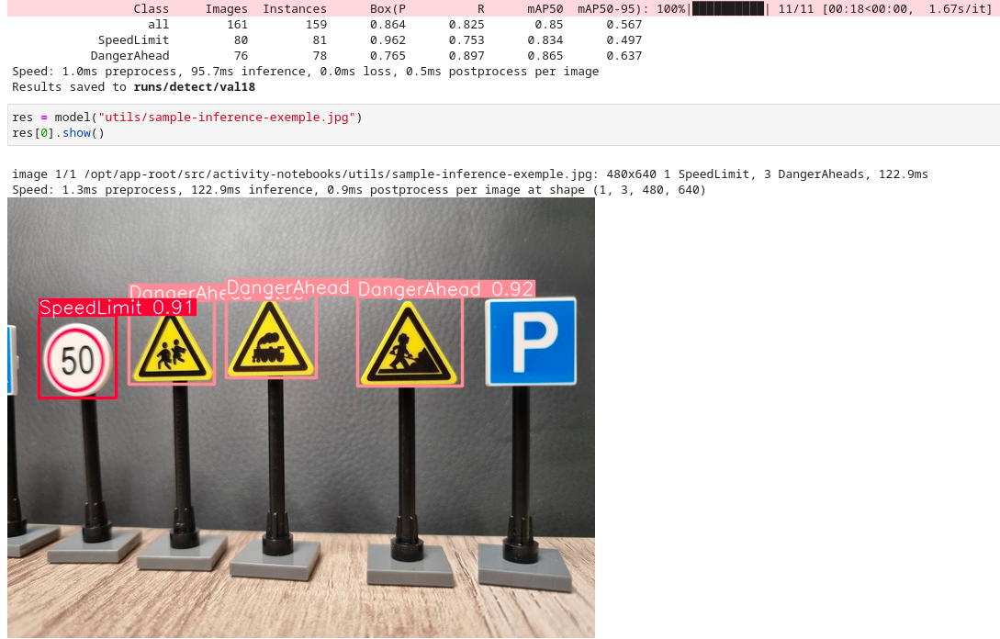
