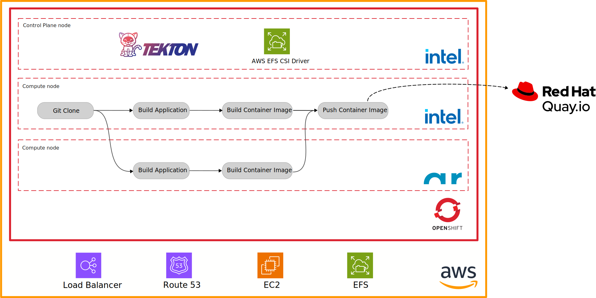

+++
title = "Pipelines CI"
draft = false
weight = 1
[[resources]]
  src = '**.png'
[[resources]]
  src = '**.svg'
+++

Dans cette étape, vous devrez déployer les pipelines CI qui construiront les images de conteneur des cinq composants clés du train :

- **capture-app**
- **intelligent-train**
- **monitoring-app**
- **train-ceq-app**
- **train-controller**

Pour vous aider, un Chart Helm est présent dans le mono repo de l'application (dossier `tekton-pipelines`).
Ce chart Helm contient des pipelines Tekton multi-architecture.
En effet, la carte Nvidia Jetson Orin dans le train est une architecture arm64.
Votre laptop est probablement une architecture x86_64.

Pour construire ces images de conteneur multi-architecture, nous avons besoin de :

- Un cluster OpenShift composé de Compute nodes x86_64 et arm64.
- Un pipeline Tekton orchestrant les constuctions d’image sur ces deux noeuds et combinant les images résultantes en un manifeste qui est ensuite déposé sur la registry quay.io.
- Du stockage persistant de type AWS EFS pour stocker le code source, les artefacts et les images de conteneurs avant leur envoi sur la registry quay.io.

[](https://www.itix.fr/fr/blog/build-multi-architecture-container-images-with-kubernetes-buildah-tekton-aws/)

Vous déploierez les pipelines tekton depuis votre environnement OpenShift DevSpaces (ce sera plus simple).

## Déployer les pipelines Tekton

Pour cela, ouvrez un terminal dans VScode.

- Ouvrez le menu hamburger (trois traits horizontaux en haut, à gauche) depuis votre workspace DevSpaces.
- Cliquez sur **Terminal** > **New Terminal**.

Depuis le terminal, découvrez les projets auxquels vous avez accès.

```sh
oc get projects
```

Vous devriez voir trois projets OpenShift :

- Votre workspace DevSpaces (`$USERID-devspaces`)
- Le projet de test (`$USERID-test`)
- Le projet OpenShift AI (`$USERID`)

Récupérez le nom du projet de test dans une variable d'environnement.

```sh
TEST_NS=$(oc get projects -o name -l env=test | cut -d / -f 2 | head -n 1)
echo "Using namespace $TEST_NS"
```

Créez les objets dans votre projet OpenShift de test.

```sh
helm template pipelines /projects/summitconnect2025-app/tekton-pipelines --set namespace="$TEST_NS" | oc apply -f -
```

{}
Le message d'avertissement *"WARNING: Kubernetes configuration file is group-readable. This is insecure."* peut être ignoré.
{}

Ouvrez la [console OpenShift]() et naviguez dans **Administrator** > **Pipelines** > **Pipelines** > **Pipelines**.


Ouvrez les quatre pipelines, un à un, et observez leur différences.
Comment sont exécutées les tâches de construction sur les architectures arm64 et x86_64 ?
En parallèle ou en série ?


## Lancer les pipelines Tekton

Créez les objets dans votre projet OpenShift de test.

```sh
helm template pipelines /projects/summitconnect2025-app/tekton-pipelines --set namespace="$TEST_NS" --values /projects/summitconnect2025-app/tekton-pipelines/values.ci.yaml | oc create -f -
```

{}
Le message d'avertissement *"WARNING: Kubernetes configuration file is group-readable. This is insecure."* peut être ignoré.
{}

Normalement, les pipelines doivent démarrer immédiatement.

Ouvrez la [console OpenShift]() et naviguez dans **Administrator** > **Pipelines** > **Pipelines** > **PipelineRuns**.


Cliquez sur le PipelineRun du composant **train-controller**.
Ouvrez l'onglet YAML, pressez la combinaison de touches **Ctrl** + **F** et saisissez `taskRunSpecs:`.

Quelles fonctions de Kubernetes avons-nous utilisé pour placer les tâches Tekton ARM64 sur les noeuds correspondants ?


## Étape suivante

Les pipelines mettent environ 20 minutes pour les plus lents à se terminer.
Pendant que ça compile, c'est le moment de passer à l'étape suivante !
