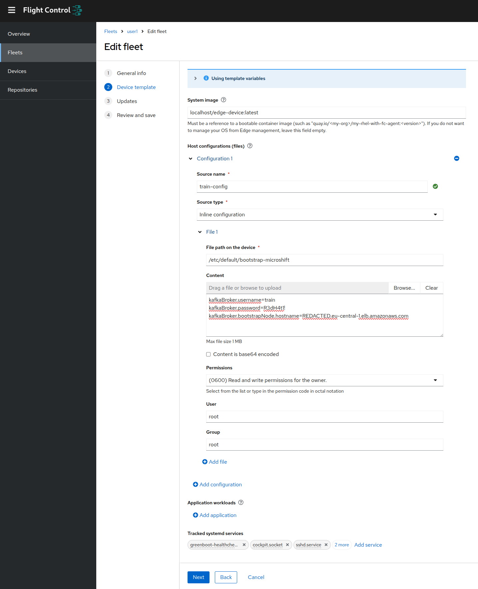
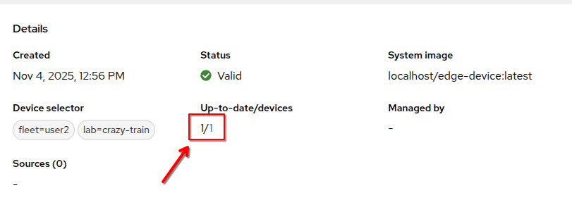
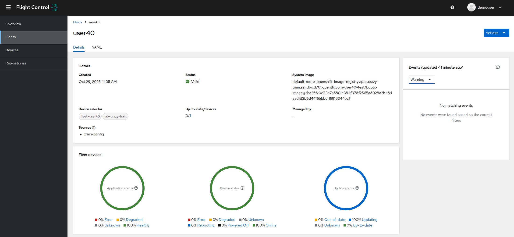
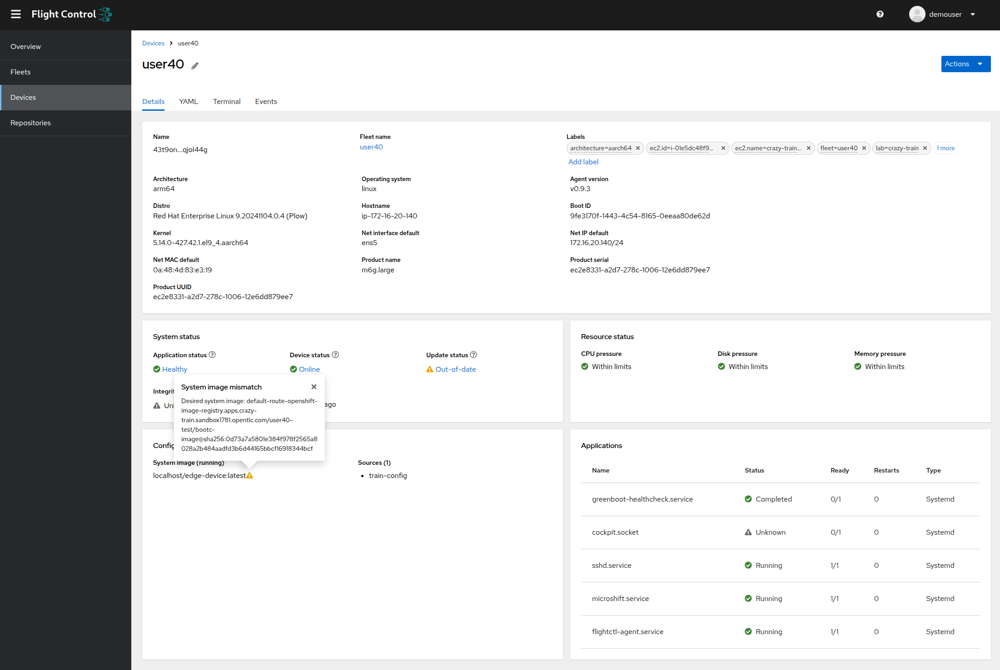

+++
title = "CD Pipelines for the Edge"
draft = false
weight = 3
[[resources]]
  src = '**.png'
[[resources]]
  src = '**.svg'
+++

In this step, you will need to deploy the CD pipeline that will build the Jetson Operating System image, including Microshift as well as the five key components of the train:

- **capture-app**
- **intelligent-train** (which contains the AI model)
- **monitoring-app**
- **train-ceq-app**
- **train-controller**

This pipeline will also trigger an update of the fleet corresponding to your Edge device.
Each participant has a virtual machine "at the Edge", connected to Red Hat Edge Manager, the Edge device fleet management system.

To help you, a Helm Chart is present in the application mono repo (`tekton-pipelines` folder).
This Helm chart contains a Tekton pipeline that builds the Jetson Operating System image and triggers the update of your Edge device.

You will deploy the tekton pipeline from your OpenShift DevSpaces environment (it will be easier).

## Connect to Red Hat Edge Manager

Connect to the [Red Hat Edge Manager console]() with your username and password.

You should see 40 Edge devices and 40 fleets, one device and one fleet per participant.

## Deploy the lego train configuration on your fleet

Navigate to **Fleets** > _your fleet_ > **Actions** > **Edit fleet configuration**


In the **Device template** section, under **Host configuration (files)**, click on **Add configuration**.

Fill in the form with the following values:

- **Source name**: `train-config`
- **Source type**: **Inline configuration**
- **File path on the device**: `/etc/default/bootstrap-microshift`
- **Content is base64 encoded**: _unchecked_
- **Permissions**: **(0600) ...**
- **User**: `root`
- **Group**: `root`
- **Content**:

```
kafkaBroker.username=train
kafkaBroker.password=R3dH4t1!
kafkaBroker.bootstrapNode.hostname=
```

Your configuration should look like this:



Click on **Next** > **Next** and **Save**.

On your fleet, click on the **X/Y** under **Up-to-date/devices** to access your Edge device list.



Click on your single Edge device.

Click on **Terminal**.
Wait for the Edge Device to contact the Edge Manager server (it can take up to a minute!).

Once the terminal is connected, execute the following command:

```sh
cat /etc/default/bootstrap-microshift
```

And confirm that your configuration file has been deployed.


## Start the Tekton pipeline

In this step we will start a tekton pipeline that will build the Edge device Operating System image and trigger its update via Red Hat Edge Manager.

To do this, open a terminal in OpenShift DevSpaces.

- Open the hamburger menu (three horizontal lines at the top left) from your DevSpaces workspace.
- Click on **Terminal** > **New Terminal**.

From the terminal, discover the projects you have access to.

```sh
oc get projects
```

You should see three OpenShift projects:

- Your DevSpaces workspace (`$USERID-devspaces`)
- The test project (`$USERID-test`)
- The OpenShift AI project (`$USERID`)

Get the test project name in an environment variable.

```sh
TEST_NS=$(oc get projects -o name -l env=test | cut -d / -f 2 | head -n 1)
echo "Using namespace $TEST_NS"
```

In your DevSpaces workspace, edit the file `tekton-pipelines/values.cd.yaml` and replace the occurrences of `userXY` with your username.
There are normally two occurrences to replace.

Create the PipelineRun object in your OpenShift test project.

```sh
helm template pipelines /projects/summitconnect2025-app/tekton-pipelines --set namespace="$TEST_NS" --values /projects/summitconnect2025-app/tekton-pipelines/values.cd.yaml | oc create -f -
```

{}
The warning message *"WARNING: Kubernetes configuration file is group-readable. This is insecure."* can be ignored.
{}

Open the [OpenShift console]() and navigate to **Administrator** > **Pipelines** > **Pipelines** > **PipelineRuns**.

Normally, the pipeline should start immediately.


## Monitor the Edge deployment

The pipeline takes about 12 minutes to complete.
Once the pipeline is finished, you should see that the fleet in Red Hat Edge Manager has been updated with the image generated by the pipeline.



On your fleet, click on the **X/Y** under **Up-to-date/devices** to access your Edge device list.


Click on your single Edge device.

You should see that your Edge device is in "out-of-date" state.



Wait a few minutes while it downloads its update, applies it and reboots.

## Verifications

Navigate to **Fleets** > _your fleet_

On your fleet, click on the **X/Y** under **Up-to-date/devices** to access your Edge device list.


Click on your single Edge device.

Click on **Terminal**.
Wait for the Edge Device to contact the Edge Manager server (it can take up to a minute!).

Once the terminal is connected, execute the following command:

```sh
export KUBECONFIG=/var/lib/microshift/resources/kubeadmin/kubeconfig
oc -n train get pods -w
```

You should see the containers constituting the train autopilot, including the **intelligent-train** which contains the AI model.

Congratulations, you just deployed an AI model to the Edge! 🎉

