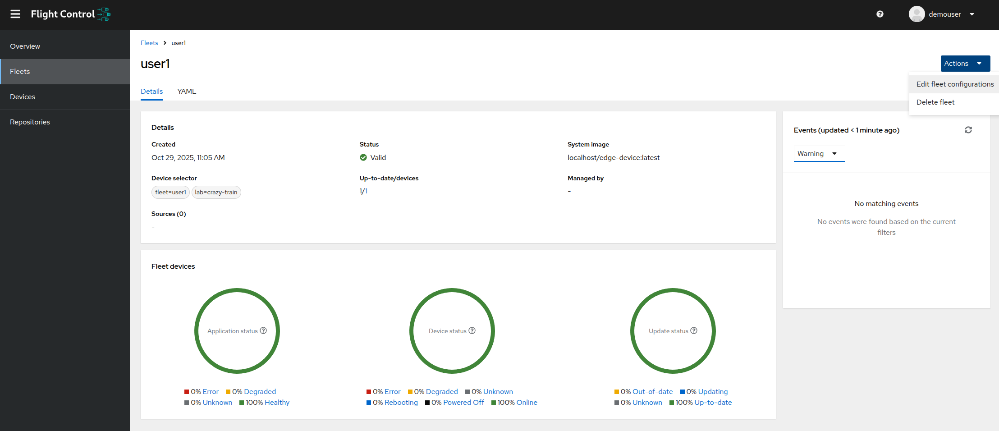
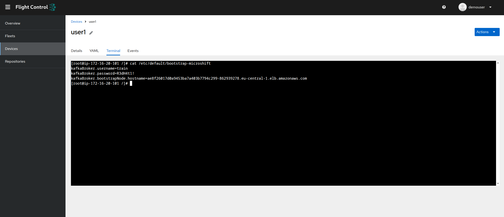
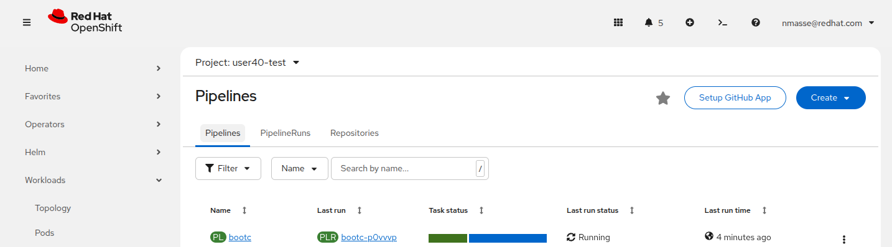

+++
title = "Pipelines CD pour le Edge"
draft = false
weight = 3
[[resources]]
  src = '**.png'
[[resources]]
  src = '**.svg'
+++

Dans cette étape, vous devrez déployer le pipeline CD qui construira l'image du Système d'Exploitation du Jetson, comprenant Microshift ainsi que les cinq composants clés du train :

- **capture-app**
- **intelligent-train**
- **monitoring-app**
- **train-ceq-app**
- **train-controller**

Ce pipeline déclenchera également une mise à jour de la flotte correspondant à votre device Edge.
Chaque participant dispose d'une machine virtuelle "at the Edge", connectée à Red Hat Edge Manager, le système de gestion de flotte de devices Edge.

Pour vous aider, un Chart Helm est présent dans le mono repo de l'application (dossier `tekton-pipelines`).
Ce chart Helm contient un pipeline Tekton permettant de construire l'image du Système d'Exploitation du Jetson.

Vous déploierez le pipeline tekton depuis votre environnement OpenShift DevSpaces (ce sera plus simple).

## Se connecter à Red Hat Edge Manager

Connectez-vous à la [console Red Hat Edge Manager]() avec votre nom d'utilisateur et votre mot de passe.

Vous devriez voir 40 devices Edge et 40 flottes, soit un device et une flotte par participant.

## Déployer la configuration du train lego sur votre flotte

Naviguez dans **Fleets** > _votre flotte_ > **Actions** > **Edit fleet configuration**



Dans la section **Device template**, sous **Host configuration (files)**, cliquez sur **Add configuration**.

Remplissez le formulaire avec les valeurs suivantes :

- **Source name** : `train-config`
- **Source type** : **Inline configuration**
- **File path on the device** : `/etc/default/bootstrap-microshift`
- **Content is base64 encoded** : _unchecked_
- **Permissions** : **(0600) ...**
- **User** : `root`
- **Group** : `root`
- **Content** :

```
kafkaBroker.username=train
kafkaBroker.password=R3dH4t1!
kafkaBroker.bootstrapNode.hostname=
```

**TODO**: Screen capture

Cliquez sur **Next** > **Next** et **Save**.

Sur votre flotte, cliquez sur le **1/1** sous **Up-to-date/devices** pour accéder à votre liste de devices Edge.

Cliquer sur votre unique device Edge.

Cliquez sur **Terminal**.
Patientez que le Device Edge contacte le serveur Edge Manager (ça peut prendre jusqu'à une minute !).

Une fois le terminal connecté, exécutez la commande suivante :

```sh
cat /etc/default/bootstrap-microshift
```

Et confirmez que votre fichier de configuration a bien été déployé.



## Démarrer le pipeline Tekton

Dans cette étape nous allons démarrer un pipeline tekton qui construira l'image du Système d'Exploitation du device Edge et déclenchera sa mise à jour via Red Hat Edge Manager.

Pour cela, ouvrez un terminal dans OpenShift DevSpaces.

- Ouvrez le menu hamburger (trois traits horizontaux en haut, à gauche) depuis votre workspace DevSpaces.
- Cliquez sur **Terminal** > **New Terminal**.

Depuis le terminal, découvrez les projets auxquels vous avez accès.

```sh
oc get projects
```

Vous devriez voir trois projets OpenShift :

- Votre workspace DevSpaces (`$USERID-devspaces`)
- Le projet de test (`$USERID-test`)
- Le projet OpenShift AI (`$USERID`)

Récupérez le nom du projet de test dans une variable d'environnement.

```sh
TEST_NS=$(oc get projects -o name -l env=test | cut -d / -f 2 | head -n 1)
echo "Using namespace $TEST_NS"
```

Dans votre workspace DevSpaces, éditez le fichier `tekton-pipelines/values.cd.yaml` et remplacez les occurrences de `userXY` par votre nom d'utilisateur.
Il y a normalement deux occurrences à remplacer.

Créez l'objet PipelineRun dans votre projet OpenShift de test.

```sh
helm template pipelines /projects/summitconnect2025-app/tekton-pipelines --set namespace="$TEST_NS" --values /projects/summitconnect2025-app/tekton-pipelines/values.cd.yaml | oc create -f -
```

{}
Le message d'avertissement *"WARNING: Kubernetes configuration file is group-readable. This is insecure."* peut être ignoré.
{}

Normalement, le pipeline doivent démarrer immédiatement.

Ouvrez la [console OpenShift]() et naviguez dans **Administrator** > **Pipelines** > **Pipelines** > **PipelineRuns**.




## Étape suivante

Les pipelines mettent environ 20 minutes pour les plus lents à se terminer.
Pendant que ça compile, c'est le moment de passer à l'étape suivante !
