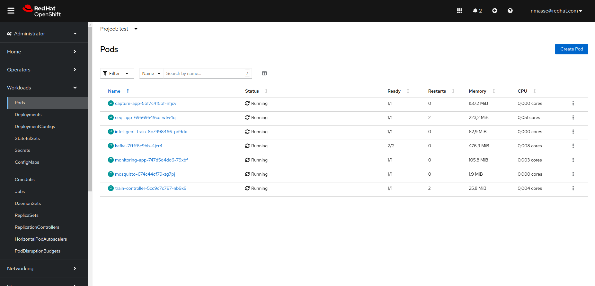
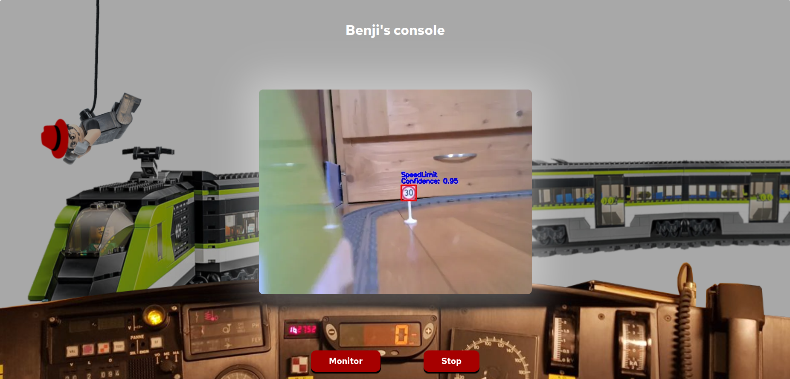

+++
title = "GitOps"
draft = false
weight = 2
[[resources]]
  src = '**.png'
+++

In this step, you will need to deploy the container images of the five key components of the train in OpenShift:

- **capture-app**
- **intelligent-train**
- **monitoring-app**
- **train-ceq-app**
- **train-controller**

To help you, a Helm chart is available in the application's mono repo (`deployment` folder).
The Helm chart is designed to deploy the images built in the previous step.
However, to save you a 20-minute wait, these images have been made available on [quay.io](https://quay.io/organization/riviera-dev-2024).

## Deployment

You'll deploy the components from your OpenShift DevSpaces environment (this will be easier).

To do this, open a terminal in VScode.

- Open the hamburger menu (three horizontal lines at the top left) from your DevSpaces workspace.
- Click on **Terminal** > **New Terminal**.

From the terminal, discover the projects to which you have access.

```sh
oc get projects
```

You should see three OpenShift projects:

- Your DevSpaces workspace (`$USERID-devspaces`)
- The test project (`$USERID-test`)
- The OpenShift AI project (`$USERID`)

Get the name of the test project from an environment variable.

```sh
TEST_NS=$(oc get projects -o name -l env=test | cut -d / -f 2 | head -n 1)
echo "Using namespace $TEST_NS"
```

Create the objects in your OpenShift test project.

```sh
helm template deployment /projects/summitconnect2025-app/deployment --set namespace="$TEST_NS" | oc apply -f -
```

{}
The warning message *"WARNING: Kubernetes configuration file is group-readable. This is insecure. "* can be ignored.
{}

Follow the Pods' progress with the following command.

```sh
oc -n "$TEST_NS" get pods -w
```

{}
You can also use the [OpenShift console]().
In this case, navigate to **Administrator** > **Workload** > **Pods** and select your project from the drop-down list.
{}

## Testing

Open the [OpenShift console]() and navigate to **Administrator** > **Networking** > **Routes**.


Right-click on the URL of the **monitoring-app** route and open the URL in a new window.
Place this window in the corner of your screen.

Open the [OpenShift console]() and navigate to **Administrator** > **Workload** > **Pods**.



Click on the Pod of the **capture-app** component.
Open the **Terminal** tab.

Enter the following command in the terminal:

```sh
curl -X POST 'http://localhost:8080/capture/test' -H 'accept: */*'
```


If all goes well, you should see the video start up in the **monitoring-app** component window.



