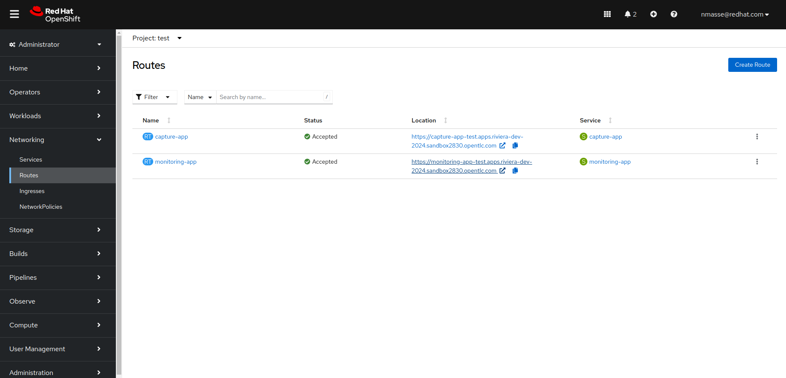

+++
title = "GitOps"
draft = false
weight = 2
[[resources]]
  src = '**.png'
+++

Dans cette étape, vous devrez déployer dans OpenShift les images de conteneur des cinq composants clés du train :

- **capture-app**
- **intelligent-train**
- **monitoring-app**
- **train-ceq-app**
- **train-controller**

Pour vous aider, un Chart Helm est présent dans le mono repo de l'application (dossier `deployment`).
Le chart Helm est conçu pour déployer les images construites à l'étape précédente.
Cependant, pour vous éviter une attente de 20 minutes, ces images ont été mises à votre disposition sur [quay.io](https://quay.io/organization/riviera-dev-2024).

## Déploiement

Vous déploierez les composants depuis votre environnement OpenShift DevSpaces (ce sera plus simple).

Pour cela, ouvrez un terminal dans VScode.

- Ouvrez le menu hamburger (trois traits horizontaux en haut, à gauche) depuis votre workspace DevSpaces.
- Cliquez sur **Terminal** > **New Terminal**.

Depuis le terminal, découvrez les projets auxquels vous avez accès.

```sh
oc get projects
```

Vous devriez voir trois projets OpenShift :

- Votre workspace DevSpaces (`$USERID-devspaces-$RANDOM`)
- Le projet de test (`$USERID-test`)
- Le projet OpenShift AI (`$USERID`)

Récupérez le nom du projet de test dans une variable d'environnement.

```sh
TEST_NS=$(oc get projects -o name -l env=test | cut -d / -f 2 | head -n 1)
echo "Using namespace $TEST_NS"
```

Créez les objets dans votre projet OpenShift de test.

```sh
helm template deployment /projects/rivieradev-app/deployment --set namespace="$TEST_NS" | oc apply -f -
```

Suivez la progression des Pods l'aide de la commande suivante.

```sh
oc -n "$TEST_NS" get pods -w
```

{}
Vous pouvez aussi utiliser la [console OpenShift]().
Dans ce cas, naviguez dans **Administrator** > **Workload** > **Pods** et sélectionnez votre projet dans la liste déroulante.
{}

## Tests

Ouvrez la [console OpenShift]() et naviguez dans **Administrator** > **Networking** > **Routes**.



Cliquez avec le bouton droit sur l'URL de la route **monitoring-app** et ouvrez l'URL dans une nouvelle fenêtre.
Placez cette fenêtre dans un coin de votre écran.

Ouvrez la [console OpenShift]() et naviguez dans **Administrator** > **Workload** > **Pods**.


Cliquez sur le Pod du composant **capture-app**.
Ouvrez l'onglet **Terminal**.

Saisissez la commande suivante dans le terminal :

```sh
curl -X POST 'http://localhost:8080/capture/test' -H 'accept: */*'
```


Si tout se passe bien, vous devriez voir la vidéo démarrer dans la fenêtre du composant **monitoring-app**.


